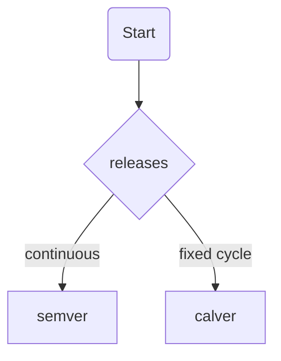

# _Naming Things_

**A humble effort to solve computer science's second-hardest problem.**

<!-- mdformat-toc start --slug=github --no-anchors --maxlevel=2 --minlevel=2 -->

- [Classes and Functions](#classes-and-functions)
- [Variables and Constants](#variables-and-constants)
- [Time](#time)
- [Abbreviations](#abbreviations)
- [Metrics, Measurements, and Units](#metrics-measurements-and-units)
- [Utils & Helpers](#utils--helpers)
- [Synonyms](#synonyms)
- [Modules and Packages](#modules-and-packages)
- [Error Handling and Exceptions](#error-handling-and-exceptions)
- [Testing](#testing)
- [Comments and Documentation](#comments-and-documentation)
- [API and Endpoint Naming](#api-and-endpoint-naming)
- [Database Naming](#database-naming)
- [Configuration and Environment Variables](#configuration-and-environment-variables)
- [Versioning](#versioning)
- [Git and Version Control](#git-and-version-control)

<!-- mdformat-toc end -->

# Preamble

> There are only two hard things in Computer Science: cache invalidation and naming things.
>
> — Phil Karlton

This document concerns natural language conventions, not syntax or code style. Rules are language-agnostic, but examples are given in Python.

[](https://xkcd.com/910/)

## Classes and Functions

### Classes

Class names are nouns or noun phrases. Think German compound nouns. E.g., `UserProfile`, `OrderItem`, `PaymentProcessor`.

Class names are singular because while its instances may represent multiple entities (e.g., a `User` class representing multiple user instances), the class itself is a blueprint for a single entity.

#### Naming Patterns

**Processors, Handlers, and Managers**

These suffixes indicate different responsibilities:

- **Processor**: Transforms data from one form to another. E.g., `PaymentProcessor`, `ImageProcessor`, `DataProcessor`.
- **Handler**: Responds to events or requests. E.g., `ErrorHandler`, `RequestHandler`, `SignalHandler`.
- **Manager**: Orchestrates multiple operations or maintains state. E.g., `ConnectionManager`, `CacheManager`, `SessionManager`.
- **Service**: Encapsulates business logic, often with external dependencies. E.g., `EmailService`, `AuthenticationService`, `NotificationService`.
- **Builder**: Constructs complex objects step by step. E.g., `QueryBuilder`, `FormBuilder`, `ReportBuilder`.
- **Factory**: Creates instances of objects. E.g., `UserFactory`, `ConnectionFactory`, `WidgetFactory`.
- **Repository**: Abstracts data access layer. E.g., `UserRepository`, `OrderRepository`, `ProductRepository`.
- **Strategy**: Represents interchangeable algorithms. E.g., `CompressionStrategy`, `SortingStrategy`, `ValidationStrategy`.
- **Validator**: Checks data against rules. E.g., `EmailValidator`, `PasswordValidator`, `FormValidator`.
- **Serializer**: Converts objects to/from a format. E.g., `JSONSerializer`, `XMLSerializer`, `UserSerializer`.
- **Adapter**: Converts one interface to another. E.g., `LegacyAPIAdapter`, `DatabaseAdapter`, `ThirdPartyAdapter`.
- **Decorator**: Adds behavior to objects. E.g., `CachedDecorator`, `LoggedDecorator`, `RetryDecorator`.
- **Observer**: Responds to state changes. E.g., `FileObserver`, `DataObserver`, `EventObserver`.

**Collections and Containers**

When a class truly represents a collection of items, use plural nouns:

```python
class Users:
    """A collection of User objects with aggregate operations."""

    def __init__(self, users: list[User]):
        self._users = users

    def active(self) -> "Users":
        """Return only active users."""
        return Users([u for u in self._users if u.is_active])

    def total_credits(self) -> int:
        """Calculate total credits across all users."""
        return sum(u.credits for u in self._users)
```

However, prefer standard collection types (`list`, `set`, `dict`) unless you need domain-specific behavior.

**Avoid Generic Suffixes**

Don't use `Base`, `Abstract`, `Manager`, `Controller`, `Helper`, `Utility`, or `Common` unless absolutely necessary. These often indicate poor design or lack of specificity.

```python
# Don't
class DataManager:
    """What kind of data? What management operations?"""


class BaseHelper:
    """Helper for what? Why is it a class?"""


# Do
class UserSessionCache:
    """Caches active user sessions with expiration."""


class EmailDeliveryQueue:
    """Manages queued emails for delivery."""
```

#### Inheritance

Specialize, don't generalize. If you feel the urge to name a base class `BaseSomething` or `AbstractSomething`, go the other way.
Make children more specific, not parents more general.

The parent class should be the most general, natural name. Child classes add specificity through prefixes or compound nouns.

##### Do's

```python
class Vehicle:
    """A means of transporting people or goods."""


class Car(Vehicle):
    """A road vehicle, typically with four wheels, powered by an internal combustion engine or electric motor."""


class SUV(Car):
    """A pedestrian death machine."""


class ElectricCar(Car):
    """A car powered by an electric motor."""
```

Another example with storage:

```python
class Storage:
    """Abstract storage interface."""

    def save(self, key: str, value: bytes) -> None:
        raise NotImplementedError


class FileStorage(Storage):
    """Stores data in the local file system."""


class S3Storage(Storage):
    """Stores data in Amazon S3."""


class EncryptedFileStorage(FileStorage):
    """Stores encrypted data in the local file system."""
```

##### Don'ts

```python
class BaseCar:
    """A road vehicle, typically with four wheels, powered by an internal combustion engine or electric motor."""


class SportsCar(BaseCar):
    """Only fun in Germany."""


# Also avoid
class AbstractStorage:
    """Forces you to think 'abstract' every time."""


class GenericHandler:
    """Generic is not descriptive."""


class CoreProcessor:
    """Core of what?"""
```

##### When Abstract\* is Acceptable

Only use `Abstract` when:

1. The language requires it for clarity (e.g., Java's explicit `abstract` keyword culture)
1. You're creating a framework and need to distinguish between the abstract protocol and a default implementation

```python
# Acceptable in frameworks
class AbstractHTTPBackend:
    """Protocol for HTTP backend implementations."""


class RequestsHTTPBackend(AbstractHTTPBackend):
    """Default implementation using the requests library."""


class AsyncHTTPBackend(AbstractHTTPBackend):
    """Async implementation using aiohttp."""
```

But even then, prefer using the language's protocol/interface features:

```python
# Better with Python's Protocol
from typing import Protocol


class HTTPBackend(Protocol):
    """Protocol for HTTP backend implementations."""

    def request(self, method: str, url: str) -> Response: ...


class RequestsBackend:
    """Implementation using the requests library."""


class AsyncBackend:
    """Implementation using aiohttp."""
```

### Functions

Function represents an action a caller can perform. Use verbs or verb phrases. E.g., `send()`, `calculate_total()`.

Function names must clearly communicate their external behavior, including side effects. E.g., `fetch_or_404()` makes it explicit that it may raise a 404 error.
They must not expose internal implementation details. E.g., avoid `send_via_smtp()`; use `send()` instead.

Loose functions should be the exception, not the rule. Prefer class methods or instance methods to group related functionality. If a function includes a noun in its name, it probably belongs to that noun's class. E.g., instead of `fetch_user_profile(user_id)`, implement `UserProfile.fetch(user_id)`.

#### Naming Conventions

**Verbs for Actions**

Use strong, specific verbs that clearly convey intent:

```python
# Don't: vague verbs
def process_data(data):
    """What kind of processing?"""


def handle_request(request):
    """Handle how?"""


def do_stuff(thing):
    """Do what stuff?"""


# Do: specific verbs
def validate_email(email: str) -> bool:
    """Validate email format against RFC 5322."""


def encrypt_password(password: str) -> str:
    """Hash password using bcrypt."""


def serialize_json(obj: dict) -> str:
    """Convert dictionary to JSON string."""
```

**Predicates and Queries**

Boolean-returning functions should be phrased as yes/no questions:

```python
# Use is_, has_, can_, should_ prefixes
def is_valid(email: str) -> bool:
    """Check if email format is valid."""


def has_permission(user: User, resource: Resource) -> bool:
    """Check if user has access to resource."""


def can_delete(user: User, item: Item) -> bool:
    """Check if user is allowed to delete item."""


def should_retry(attempt: int, error: Exception) -> bool:
    """Determine if operation should be retried."""


# Don't: ambiguous names
def valid(email: str) -> bool:
    """Is this validating or returning validity?"""


def check_permission(user: User) -> bool:
    """Check... and then what?"""
```

**Side Effects Must Be Obvious**

If a function has side effects (modifies state, performs I/O, raises exceptions), the name must make this clear:

```python
# Don't: hidden side effects
def get_user(user_id: int) -> User:
    """Actually creates user if not found - surprise!"""
    user = db.query(User).filter_by(id=user_id).first()
    if not user:
        user = User(id=user_id)
        db.session.add(user)
        db.session.commit()
    return user


# Do: explicit side effects
def get_or_create_user(user_id: int) -> tuple[User, bool]:
    """Get existing user or create new one. Returns (user, created)."""
    user = db.query(User).filter_by(id=user_id).first()
    if not user:
        user = User(id=user_id)
        db.session.add(user)
        db.session.commit()
        return user, True
    return user, False


# Or separate concerns
def get_user(user_id: int) -> User | None:
    """Get user by ID or None if not found."""
    return db.query(User).filter_by(id=user_id).first()


def create_user(user_id: int) -> User:
    """Create and persist new user."""
    user = User(id=user_id)
    db.session.add(user)
    db.session.commit()
    return user
```

More examples of side-effect naming:

```python
# Exceptions in names
def fetch_or_404(resource_id: int) -> Resource:
    """Fetch resource or raise Http404."""


def require_authentication(request: Request) -> User:
    """Return authenticated user or raise Unauthorized."""


# Mutations in names
def increment_counter(key: str) -> int:
    """Increment counter in database and return new value."""


def append_log_entry(message: str) -> None:
    """Append message to log file."""


# I/O in names
def save_to_file(data: bytes, path: str) -> None:
    """Write data to file at path."""


def send_email(to: str, subject: str, body: str) -> None:
    """Send email via SMTP."""
```

**Parameter Count and Named Parameters**

Functions with more than 3 parameters should use keyword arguments or consider refactoring:

```python
# Don't: too many positional parameters
def create_user(name, email, age, address, phone, city, country, zip_code):
    pass


# Do: use a data class or dict
from dataclasses import dataclass


@dataclass
class UserData:
    name: str
    email: str
    age: int
    address: str
    phone: str
    city: str
    country: str
    zip_code: str


def create_user(data: UserData) -> User:
    """Create user from provided data."""
    pass


# Or: use keyword-only arguments
def create_user(
    *,
    name: str,
    email: str,
    age: int,
    address: str,
    phone: str,
    city: str,
    country: str,
    zip_code: str,
) -> User:
    """Create user with provided details."""
    pass
```

#### Implementation Details Leakage

Function names must describe *what* they do, not *how* they do it:

```python
# Don't: exposing implementation
def fetch_from_redis_cache(key: str) -> Any:
    """What if we switch to Memcached?"""


def validate_with_regex(email: str) -> bool:
    """Implementation detail."""


def send_via_smtp(email: Email) -> None:
    """What if we switch to SendGrid API?"""


def sort_with_quicksort(items: list) -> list:
    """Algorithm choice is internal."""


# Do: describe behavior
def fetch_cached(key: str) -> Any:
    """Fetch value from cache."""


def validate_email(email: str) -> bool:
    """Validate email format."""


def send_email(email: Email) -> None:
    """Send email to recipient."""


def sort_items(items: list) -> list:
    """Sort items in ascending order."""
```

#### Symmetry and Pairs

Functions that are opposites should be named symmetrically:

```python
# Good pairs
open() / close()
start() / stop()
begin() / end()
create() / delete()
add() / remove()
push() / pop()
acquire() / release()
lock() / unlock()
show() / hide()
enable() / disable()
attach() / detach()
connect() / disconnect()

# Bad asymmetry
open() / shutdown()  # Use close()
start() / kill()  # Use stop()
create() / destroy()  # Use delete()
add() / clear()  # Use remove()
```

### Methods

Methods are functions bound to objects. The same principles apply, but with additional considerations for object context.

#### Object Context

Avoid including the object's name in method names—it's redundant and suggests poor responsibility assignment:

```python
# Don't: redundant object name
class User:
    def send_user_email(self) -> None:
        """'user' is redundant—we're already in User."""

    def validate_user(self) -> bool:
        """'user' is redundant."""

    def get_user_profile(self) -> Profile:
        """'user' is redundant."""


# Do: implicit context
class User:
    def send_email(self) -> None:
        """Send email to user."""

    def validate(self) -> bool:
        """Validate user data."""

    def get_profile(self) -> Profile:
        """Get user profile."""
```

#### Wrong Responsibility

If you find yourself including another object's name in a method, the method likely belongs to the other object:

```python
# Don't: method on wrong class
class User:
    def send_email(self, subject: str, body: str) -> None:
        """User shouldn't know about email sending."""
        smtp = SMTP()
        smtp.send(self.email, subject, body)

    def charge_credit_card(self, amount: Decimal) -> None:
        """User shouldn't handle payment processing."""
        processor = PaymentProcessor()
        processor.charge(self.credit_card, amount)


# Do: proper responsibility separation
class User:
    email: str
    credit_card: str


class EmailService:
    def send_to_user(self, user: User, subject: str, body: str) -> None:
        """Send email to user."""
        self.smtp.send(user.email, subject, body)


class PaymentProcessor:
    def charge_user(self, user: User, amount: Decimal) -> None:
        """Charge user's credit card."""
        self.gateway.charge(user.credit_card, amount)


# Even better: dedicated objects
class Email:
    def __init__(self, to: str, subject: str, body: str):
        self.to = to
        self.subject = subject
        self.body = body

    def send(self) -> None:
        """Send this email."""
        smtp = SMTP()
        smtp.send(self.to, self.subject, self.body)


class Payment:
    def __init__(self, card: str, amount: Decimal):
        self.card = card
        self.amount = amount

    def process(self) -> None:
        """Process this payment."""
        gateway = PaymentGateway()
        gateway.charge(self.card, self.amount)
```

#### Property vs. Method

Use properties for simple attribute access, methods for actions or computations:

```python
class Rectangle:
    def __init__(self, width: float, height: float):
        self._width = width
        self._height = height

    # Property: simple attribute access
    @property
    def width(self) -> float:
        """Width of rectangle."""
        return self._width

    @property
    def area(self) -> float:
        """Area of rectangle (computed, but cheap and deterministic)."""
        return self._width * self._height

    # Method: action or expensive computation
    def resize(self, width: float, height: float) -> None:
        """Resize rectangle (action with side effect)."""
        self._width = width
        self._height = height

    def intersects(self, other: "Rectangle") -> bool:
        """Check if this rectangle intersects another (query with parameter)."""
        return not (
            self.right < other.left
            or self.left > other.right
            or self.bottom < other.top
            or self.top > other.bottom
        )
```

Guidelines:

- **Use properties** for: simple getters, cheap computed values, values that appear like attributes
- **Use methods** for: actions, expensive operations, operations with parameters, operations with side effects

#### Getters and Setters

Python and many modern languages prefer properties over explicit getters/setters:

```python
# Don't: Java-style getters/setters
class User:
    def get_name(self) -> str:
        return self._name

    def set_name(self, name: str) -> None:
        self._name = name


# Do: use properties
class User:
    @property
    def name(self) -> str:
        """User's full name."""
        return self._name

    @name.setter
    def name(self, value: str) -> None:
        if not value.strip():
            raise ValueError("Name cannot be empty")
        self._name = value


# Even better: use dataclasses or attrs when appropriate
from dataclasses import dataclass


@dataclass
class User:
    name: str
    email: str
```

#### Static Methods and Class Methods

Name these like regular functions, but consider if they should be functions instead:

```python
class User:
    @staticmethod
    def validate_email(email: str) -> bool:
        """This could be a module-level function."""
        return "@" in email

    @classmethod
    def from_dict(cls, data: dict) -> "User":
        """Alternate constructor—good use of class method."""
        return cls(name=data["name"], email=data["email"])

    @classmethod
    def find_by_email(cls, email: str) -> "User | None":
        """Factory method—good use of class method."""
        return db.query(cls).filter_by(email=email).first()
```

#### Fluent Interfaces and Method Chaining

When designing chainable methods, use verbs and return `self`:

```python
class QueryBuilder:
    def where(self, condition: str) -> "QueryBuilder":
        """Add WHERE clause."""
        self._conditions.append(condition)
        return self

    def order_by(self, field: str) -> "QueryBuilder":
        """Add ORDER BY clause."""
        self._order = field
        return self

    def limit(self, count: int) -> "QueryBuilder":
        """Add LIMIT clause."""
        self._limit = count
        return self

    def execute(self) -> list[dict]:
        """Execute query and return results."""
        # Terminal method—doesn't return self
        return self._execute_query()


# Usage
results = QueryBuilder().where("age > 18").order_by("name").limit(10).execute()
```

## Variables and Constants

### Variables

Variables should be named as nouns or noun phrases that clearly describe what they contain, not how they're used.

#### Descriptive Names

```python
# Don't: vague or abbreviated
x = 42
temp = get_data()
data = fetch_user()
result = calculate()
info = get_info()
val = compute()

# Do: descriptive and specific
user_age = 42
api_response = get_data()
current_user = fetch_user()
monthly_revenue = calculate()
user_profile = get_info()
discount_percentage = compute()
```

#### Context Matters

The amount of context needed depends on scope:

```python
# Short-lived variables in small scopes can be concise
for user in users:
    print(user.name)

for i, item in enumerate(items):
    print(f"{i}: {item}")


# Longer-lived variables need more context
class ShoppingCart:
    def __init__(self):
        self.items: list[Item] = []
        self.total_price: Decimal = Decimal("0.00")
        self.discount_percentage: Decimal = Decimal("0.00")
        self.tax_rate: Decimal = Decimal("0.00")
        self.shipping_cost: Decimal = Decimal("0.00")
```

#### Boolean Variables

Boolean variables should be phrased as yes/no questions:

```python
# Do: clear boolean names
is_valid = validate_email(email)
has_permission = user.can_edit(document)
should_retry = attempt_count < max_attempts
can_delete = user.is_admin or item.owner == user
is_empty = len(items) == 0
has_expired = expiration_date < datetime.now()
is_authenticated = session.user_id is not None

# Don't: ambiguous names
valid = check_email(email)  # Is this the validation result or the email?
permission = user.check(document)  # What kind of permission?
retry = attempt_count < max_attempts  # Verb or boolean?
delete = user.is_admin  # Verb or boolean?
```

#### Collections

Name collections using plural nouns:

```python
# Do: plural for collections
users = User.query.all()
active_orders = Order.query.filter_by(status="active").all()
error_messages = []
configuration_options = {}

# Do: descriptive collection names
pending_payments = Payment.query.filter_by(status="pending")
completed_tasks = [t for t in tasks if t.is_complete]
failed_login_attempts = LoginAttempt.query.filter_by(success=False)

# Don't: singular for collections
user = User.query.all()  # Confusing - plural but named singular
order_list = []  # Redundant - list suffix obvious from type
message_array = []  # Redundant - array suffix unnecessary
```

#### Counters and Indices

```python
# Do: descriptive counter names
user_count = len(users)
attempt_number = 1
retry_count = 0
page_index = 0
current_position = 0

# Acceptable: conventional loop indices
for i in range(10):
    print(i)

for row_idx, row in enumerate(rows):
    for col_idx, cell in enumerate(row):
        print(f"({row_idx}, {col_idx}): {cell}")

# Don't: cryptic single letters for important values
n = len(users)  # Use user_count
c = 0  # Use retry_count
i = 0  # OK in loops, not for persistent state
```

#### Temporary Variables

Even temporary variables need clear names:

```python
# Don't: generic temp names
temp = user.email
temp2 = temp.lower()
temp3 = temp2.strip()
return temp3

# Do: descriptive names even for temps
email = user.email
lowercase_email = email.lower()
normalized_email = lowercase_email.strip()
return normalized_email

# Or: chain operations when reasonable
return user.email.lower().strip()
```

### Constants

Constants should be SCREAMING_SNAKE_CASE and defined at module level.

#### Configuration Constants

```python
# Do: clear configuration constants
MAX_LOGIN_ATTEMPTS = 3
SESSION_TIMEOUT_SECONDS = 3600
DEFAULT_PAGE_SIZE = 20
CACHE_EXPIRY_HOURS = 24
MAX_FILE_UPLOAD_SIZE_MB = 10


# Group related constants
class EmailConfig:
    SMTP_HOST = "smtp.example.com"
    SMTP_PORT = 587
    FROM_ADDRESS = "noreply@example.com"
    MAX_RECIPIENTS = 50


# Or use an enum for related values
from enum import Enum


class UserRole(Enum):
    ADMIN = "admin"
    MODERATOR = "moderator"
    USER = "user"
    GUEST = "guest"
```

#### Magic Numbers and Strings

Replace magic values with named constants:

```python
# Don't: magic numbers
def calculate_discount(price: Decimal) -> Decimal:
    if price > 100:
        return price * 0.1
    elif price > 50:
        return price * 0.05
    return Decimal("0.00")


# Do: named constants
LARGE_ORDER_THRESHOLD = Decimal("100.00")
MEDIUM_ORDER_THRESHOLD = Decimal("50.00")
LARGE_ORDER_DISCOUNT_RATE = Decimal("0.10")
MEDIUM_ORDER_DISCOUNT_RATE = Decimal("0.05")


def calculate_discount(price: Decimal) -> Decimal:
    if price > LARGE_ORDER_THRESHOLD:
        return price * LARGE_ORDER_DISCOUNT_RATE
    elif price > MEDIUM_ORDER_THRESHOLD:
        return price * MEDIUM_ORDER_DISCOUNT_RATE
    return Decimal("0.00")


# Don't: magic strings
if user.role == "admin":
    allow_access()

# Do: named constants or enums
ADMIN_ROLE = "admin"
if user.role == ADMIN_ROLE:
    allow_access()


# Better: use enum
class UserRole(Enum):
    ADMIN = "admin"
    USER = "user"


if user.role == UserRole.ADMIN:
    allow_access()
```

#### API and External Constants

```python
# HTTP Status Codes
HTTP_OK = 200
HTTP_CREATED = 201
HTTP_BAD_REQUEST = 400
HTTP_UNAUTHORIZED = 401
HTTP_NOT_FOUND = 404
HTTP_INTERNAL_ERROR = 500

# Or use standard library
from http import HTTPStatus

response.status_code = HTTPStatus.OK

# API Endpoints
API_BASE_URL = "https://api.example.com/v1"
USER_ENDPOINT = f"{API_BASE_URL}/users"
ORDER_ENDPOINT = f"{API_BASE_URL}/orders"

# Third-party service keys
AWS_REGION = "us-east-1"
S3_BUCKET_NAME = "my-app-uploads"
REDIS_URL = "redis://localhost:6379/0"
```

#### Physical and Mathematical Constants

```python
# Physical constants
SPEED_OF_LIGHT_M_PER_S = 299792458
GRAVITATIONAL_CONSTANT = 6.67430e-11
AVOGADRO_NUMBER = 6.02214076e23

# Mathematical constants (or use math module)
PI = 3.14159265359
E = 2.71828182846

# Or better: use standard library
import math

circumference = 2 * math.pi * radius
```

#### Environment-Specific Constants

```python
# Development
DEBUG = True
LOG_LEVEL = "DEBUG"
DATABASE_URL = "sqlite:///dev.db"

# Production (from environment variables)
import os

DEBUG = os.getenv("DEBUG", "False") == "True"
LOG_LEVEL = os.getenv("LOG_LEVEL", "INFO")
DATABASE_URL = os.getenv("DATABASE_URL", "postgresql://...")
SECRET_KEY = os.getenv("SECRET_KEY")  # Never hardcode secrets!
```

### Type Hints and Annotations

Use type hints to document expected types:

```python
from typing import Optional, List, Dict, Union
from decimal import Decimal
from datetime import datetime

# Do: typed variables
user_id: int = 123
email_address: str = "user@example.com"
is_active: bool = True
price: Decimal = Decimal("19.99")
created_at: datetime = datetime.now()
tags: list[str] = ["python", "coding"]
metadata: dict[str, str] = {"key": "value"}
result: Optional[User] = get_user(user_id)

# For complex types
from typing import TypeAlias

UserId: TypeAlias = int
EmailAddress: TypeAlias = str
JSONDict: TypeAlias = dict[str, any]

user_id: UserId = 123
email: EmailAddress = "user@example.com"
config: JSONDict = {"debug": True}
```

### Naming Patterns for Common Scenarios

#### Caching

```python
# Cache keys
user_cache_key = f"user:{user_id}"
session_cache_key = f"session:{session_id}"

# Cached values
cached_user: User | None = cache.get(user_cache_key)
cached_response: dict | None = cache.get(response_cache_key)

# Cache TTL
USER_CACHE_TTL_SECONDS = 300
SESSION_CACHE_TTL_SECONDS = 1800
```

#### Database Operations

```python
# Query results
users: list[User] = db.query(User).all()
active_users: list[User] = db.query(User).filter_by(is_active=True).all()
user_count: int = db.query(User).count()

# Single results
user: User | None = db.query(User).filter_by(id=user_id).first()
latest_order: Order | None = db.query(Order).order_by(Order.created_at.desc()).first()
```

#### Error Handling

```python
# Exceptions
authentication_error = AuthenticationError("Invalid credentials")
validation_errors: list[ValidationError] = []
last_exception: Exception | None = None

# Error messages
error_message: str = "Invalid input"
error_details: dict[str, list[str]] = {"email": ["Invalid format"]}
```

#### Flags and State

```python
# State tracking
is_initialized: bool = False
has_changes: bool = False
is_processing: bool = False
should_continue: bool = True

# Counters
retry_count: int = 0
success_count: int = 0
failure_count: int = 0
```

## Time

_[Time zones are hard](https://www.youtube.com/watch?v=-5wpm-gesOY); don't make it harder._

### Events & Points in Time

Points in time should always have a little `at`-suffix to communicate they represent a specific moment rather than a duration or interval.

Furthermore, they must be in the language's date type (e.g., `datetime` in Python, `Date` in JavaScript) as well as timezone-aware.

Hindsight is 20/20; name all dates in the past tense, e.g., `created_at`, `updated_at`, `deleted_at`. Even if the event is in the future, e.g., `scheduled_at`, `expired_at`, `started_at`. Time passes. By the time you are debugging code, everything is in the past.

Avoid locale-specific string representations or include a timezone suffix. Suffix dates according to their [IANA timezone](https://en.wikipedia.org/wiki/List_of_tz_database_time_zones).

#### Standard Timestamp Names

Use these conventional names for common lifecycle events:

```python
from datetime import datetime, timezone


class Article:
    created_at: datetime  # When the record was created
    updated_at: datetime  # When the record was last modified
    deleted_at: datetime | None  # When the record was soft-deleted (None if active)
    published_at: datetime | None  # When the article was published
    archived_at: datetime | None  # When the article was archived
    scheduled_at: datetime  # When a future action is scheduled
    started_at: datetime  # When a process/task began
    completed_at: datetime | None  # When a process/task finished
    failed_at: datetime | None  # When a process/task failed
    expired_at: datetime  # When something becomes invalid
    accessed_at: datetime  # When something was last accessed
    verified_at: datetime | None  # When something was verified
    confirmed_at: datetime | None  # When something was confirmed
```

#### Timezone-Aware Dates

Always use timezone-aware datetimes. If you need to store dates in different timezones, include the timezone in the field name:

```python
import datetime

# Do: base case with UTC
created_at: datetime.datetime = datetime.datetime.now(tz=datetime.timezone.utc)

# Do: explicit timezone when storing multiple
event_time_utc: datetime.datetime
event_time_local: datetime.datetime  # With timezone info
event_time_america_new_york: datetime.datetime

# Do: date-only values with context
birth_date: datetime.date  # No timezone needed for dates
birth_date_utc: datetime.date  # If timezone context matters
```

#### Alternative Representations

When storing timestamps in non-datetime formats, use clear suffixes:

```python
import datetime

# UNIX Epoch timestamp (seconds since 1970-01-01 00:00:00 UTC)
created_at_ts: float = datetime.datetime.now(tz=datetime.timezone.utc).timestamp()
created_at_ms: int = int(created_at_ts * 1000)  # milliseconds

# ISO 8601 string with timezone
created_at_iso: str = datetime.datetime.now(tz=datetime.timezone.utc).isoformat()
# Example: "2024-03-15T14:30:00+00:00"

# Human-readable format (avoid in code, ok for display)
created_at_display: str = "March 15, 2024 at 2:30 PM UTC"
```

#### Edge Cases and Special Situations

```python
from datetime import datetime, timezone, timedelta


class Subscription:
    # Renewable subscriptions
    current_period_started_at: datetime
    current_period_ends_at: datetime
    next_billing_at: datetime

    # Trial periods
    trial_started_at: datetime
    trial_ends_at: datetime

    # Cancellations (note: past tense even for future events)
    cancel_requested_at: datetime | None
    canceled_at: datetime | None  # Immediate cancellation
    cancels_at: datetime | None  # Scheduled future cancellation

    # Grace periods
    grace_period_started_at: datetime | None
    grace_period_ends_at: datetime | None


class Task:
    # Scheduled task with retry logic
    scheduled_at: datetime
    started_at: datetime | None
    completed_at: datetime | None
    failed_at: datetime | None
    retry_after: datetime | None  # When to retry after failure
    last_attempted_at: datetime | None

    # SLA tracking
    due_at: datetime
    overdue_at: datetime | None  # Computed: when it became overdue
```

#### Don'ts

```python
import datetime

# Don't: present tense
start = datetime.datetime.now(tz=datetime.timezone.utc)
creation_time = datetime.datetime.now(tz=datetime.timezone.utc)

# Don't: no event suffix (ambiguous)
created = datetime.datetime.now()
updated = datetime.datetime.now()
scheduled = datetime.datetime.now()

# Don't: naive datetime (no timezone)
created_at: datetime.datetime = datetime.datetime.now()

# Don't: ambiguous timestamp format
created_timestamp: int = 1234567890  # Seconds? Milliseconds? Microseconds?

# Don't: vague naming
time: datetime.datetime  # Time of what?
date: datetime.date  # Date of what?
when: datetime.datetime  # When what?
```

### Durations and Intervals

Durations represent lengths of time, not specific moments. They should be either unambiguously typed (e.g., `timedelta` in Python, `Duration` in Java) or have a suffix indicating the unit of time.

#### Unit Suffixes

Use these standard suffixes for time units:

- `_ns` - nanoseconds
- `_us` or `_μs` - microseconds
- `_ms` - milliseconds
- `_secs` - seconds
- `_mins` - minutes
- `_hours` - hours
- `_days` - days
- `_weeks` - weeks
- `_months` - months (use with caution, not all months are equal)
- `_years` - years (use with caution, leap years exist)

#### Do's

```python
import datetime

# Best: typed duration
timeout: datetime.timedelta = datetime.timedelta(seconds=30)
cache_ttl: datetime.timedelta = datetime.timedelta(hours=24)
retry_delay: datetime.timedelta = datetime.timedelta(minutes=5)

# Good: explicit unit suffix
timeout_secs: int = 30
timeout_ms: int = 30000
cache_ttl_hours: int = 24
retry_delay_mins: int = 5
session_lifetime_days: int = 7

# For very precise timing
response_time_ns: int = 1234567  # nanoseconds
latency_us: float = 123.45  # microseconds
```

#### Intervals and Ranges

When representing a range between two points in time:

```python
from datetime import datetime, timedelta


class Report:
    # For date ranges
    period_start: datetime  # or: range_start, interval_start
    period_end: datetime  # or: range_end, interval_end

    # Alternative: use descriptive names
    report_from: datetime
    report_to: datetime

    # Duration can be computed or stored
    period_duration: timedelta

    # For recurring intervals
    interval: timedelta  # Time between occurrences
    frequency: str  # "daily", "weekly", "monthly"
    repeat_every: timedelta


class WorkShift:
    shift_starts_at: datetime
    shift_ends_at: datetime
    shift_duration: timedelta  # Computed or stored

    # Break times
    break_duration: timedelta
    break_starts_at: datetime | None
    break_ends_at: datetime | None
```

#### Relative Times

For relative time expressions:

```python
from datetime import timedelta


class CacheConfig:
    # How long before expiration
    ttl: timedelta  # Time To Live
    max_age: timedelta
    expires_in: timedelta

    # How long since something
    idle_timeout: timedelta  # Time of inactivity before timeout
    session_timeout: timedelta

    # How long to wait
    retry_after: timedelta
    cooldown_period: timedelta
    grace_period: timedelta


class RateLimiter:
    window_size: timedelta  # Time window for rate limiting
    window_size_secs: int = 60  # 60-second window

    # Backoff strategies
    initial_delay: timedelta
    max_delay: timedelta
    backoff_multiplier: float = 2.0
```

#### Don'ts

```python
# Don't: no interval-specific type or unit
timeout: int = 30  # 30 what? Seconds? Minutes? Milliseconds?
duration: float = 5.5  # Ambiguous unit
wait: int = 1000  # Unclear unit

# Don't: confusing names
time: int = 60  # Time of what? Duration? Timestamp?
delay: float = 1.5  # Unit unclear
interval: int = 5  # Unit unclear

# Don't: mixing units inconsistently
timeout_secs: int = 30
retry_delay: int = 5000  # Is this milliseconds? Inconsistent with timeout_secs

# Don't: using "time" for durations
connection_time: int = 30  # Ambiguous: connection timestamp or timeout duration?
processing_time: int = 100  # Use processing_duration_ms instead
```

#### Advanced: Deadline vs. Timeout vs. TTL

These are subtly different and should be named accordingly:

```python
from datetime import datetime, timedelta


class Task:
    # Timeout: maximum duration allowed
    execution_timeout: timedelta  # How long the task can run

    # Deadline: absolute point in time
    must_complete_by: datetime  # Hard deadline
    due_at: datetime  # Expected completion time

    # TTL: how long until expiration
    ttl: timedelta  # How long until this becomes invalid


class CachedItem:
    cached_at: datetime  # When it was cached
    expires_at: datetime  # When it expires (absolute time)
    ttl: timedelta  # How long it stays valid (duration)
    max_age: timedelta  # Maximum age before refresh needed

    def is_expired(self) -> bool:
        """Check if cache entry has expired."""
        return datetime.now(timezone.utc) > self.expires_at

    def is_stale(self) -> bool:
        """Check if cache entry exceeds max age."""
        age = datetime.now(timezone.utc) - self.cached_at
        return age > self.max_age
```

## Abbreviations

> Abbreviations rely on context you may or may not have.
>
> — [CodeAesthetic](https://www.youtube.com/watch?v=-J3wNP6u5YU)

[](https://xkcd.com/1221/)

**Don't use abbreviations!**

Unless… they are technical acronyms that are universally known outside your team's domain, e.g., `HTML`, `URL`. Use them if they are more common than their unabbreviated counterparts.

### The Acronym Test

Ask yourself:

1. Would a new developer understand this without domain knowledge?
1. Is the acronym used more often than the full term in technical documentation?
1. Would autocomplete find this more easily than the full term?

If you answered "no" to any of these, spell it out.

### Do's: Acceptable Acronyms

These acronyms are universally recognized in software development:

#### Web & Networking

- **HTML** (HyperText Markup Language)
- **CSS** (Cascading Style Sheets)
- **URL** (Uniform Resource Locator)
- **URI** (Uniform Resource Identifier)
- **HTTP** (HyperText Transfer Protocol)
- **HTTPS** (HyperText Transfer Protocol Secure)
- **FTP** (File Transfer Protocol)
- **SMTP** (Simple Mail Transfer Protocol)
- **DNS** (Domain Name System)
- **TLS** (Transport Layer Security)
- **SSL** (Secure Sockets Layer)
- **TCP** (Transmission Control Protocol)
- **UDP** (User Datagram Protocol)
- **IPv4** (Internet Protocol Version 4)
- **IPv6** (Internet Protocol Version 6)
- **REST** (Representational State Transfer)
- **CORS** (Cross-Origin Resource Sharing)
- **CDN** (Content Delivery Network)

#### Data Formats & Protocols

- **JSON** (JavaScript Object Notation)
- **XML** (eXtensible Markup Language)
- **YAML** (YAML Ain't Markup Language)
- **CSV** (Comma-Separated Values)
- **JWT** (JSON Web Token)
- **MIME** (Multipurpose Internet Mail Extensions)

#### Databases & Storage

- **SQL** (Structured Query Language)
- **CRUD** (Create, Read, Update, Delete)
- **ACID** (Atomicity, Consistency, Isolation, Durability)
- **NoSQL** (Not Only SQL)
- **ORM** (Object-Relational Mapping)

#### Development & Architecture

- **API** (Application Programming Interface)
- **SDK** (Software Development Kit)
- **CLI** (Command Line Interface)
- **GUI** (Graphical User Interface)
- **IDE** (Integrated Development Environment)
- **CI/CD** (Continuous Integration/Continuous Deployment)
- **MVC** (Model-View-Controller)
- **SPA** (Single Page Application)
- **PWA** (Progressive Web App)

#### Infrastructure & Operations

- **CPU** (Central Processing Unit)
- **GPU** (Graphics Processing Unit)
- **RAM** (Random Access Memory)
- **SSD** (Solid State Drive)
- **OS** (Operating System)
- **VM** (Virtual Machine)
- **AWS** (Amazon Web Services) - when referring to the platform

#### Security & Authentication

- **OAuth** (Open Authorization)
- **SSO** (Single Sign-On)
- **2FA** (Two-Factor Authentication)
- **MFA** (Multi-Factor Authentication)

### Don'ts

- IP – could mean `Intellectual Property`, use `IPv4` or `IPv6`
- temp – use `temporary` or `temperature`
- addr – use `address`
- num – use `number`
- cnt – use `count`
- cfg – use `config` or `configuration`
- msg – use `message`
- calc – use `calculate` or `calculation`
- init – use `initialize` or `initialization`
- var – use `variable`
- obj – use `object`
- func – use `function` or `method`
- btn – use `button`
- usr – use `user`
- pwd – use `password`
- db – use `database`

## Metrics, Measurements, and Units

### Units

Add an explicit unit suffix to all measurements. Use [SI unit symbols](https://en.wikipedia.org/wiki/International_System_of_Units#Unit_symbols) for brevity.

When persisting metrics, consider using SI (metric) units instead of [freedom units](https://en.wiktionary.org/wiki/freedom_units), as they are the international standard and simplify conversions.

#### Do's

```python
class WeatherReport:
    temperature_c: float  # temperature in degrees Celsius
    temperature_f: float  # temperature in degrees Fahrenheit
    distance_km: float  # distance in kilometers
    distance_m: float  # distance in meters
    weight_kg: float  # weight in kilograms
    weight_g: float  # weight in grams
    speed_kmh: float  # speed in kilometers per hour
    speed_ms: float  # speed in meters per second
    volume_l: float  # volume in liters
    volume_ml: float  # volume in milliliters
    pressure_pa: float  # pressure in pascals
    pressure_hpa: float  # pressure in hectopascals
    energy_j: float  # energy in joules
    power_w: float  # power in watts
    frequency_hz: float  # frequency in hertz
```

#### Common SI Unit Suffixes

- **Length**: `_m` (meters), `_km` (kilometers), `_cm` (centimeters), `_mm` (millimeters)
- **Mass**: `_kg` (kilograms), `_g` (grams), `_mg` (milligrams)
- **Time**: `_s` (seconds), see [Time](#time) section for more
- **Temperature**: `_c` (Celsius), `_k` (Kelvin), `_f` (Fahrenheit)
- **Volume**: `_l` (liters), `_ml` (milliliters), `_m3` (cubic meters)
- **Speed**: `_ms` (meters/second), `_kmh` (kilometers/hour)
- **Area**: `_m2` (square meters), `_km2` (square kilometers)
- **Pressure**: `_pa` (pascals), `_hpa` (hectopascals), `_bar` (bar)
- **Energy**: `_j` (joules), `_kj` (kilojoules), `_kwh` (kilowatt-hours)
- **Power**: `_w` (watts), `_kw` (kilowatts), `_mw` (megawatts)
- **Frequency**: `_hz` (hertz), `_khz` (kilohertz), `_mhz` (megahertz)
- **Angle**: `_deg` (degrees), `_rad` (radians)
- **Data**: `_b` (bytes), `_kb` (kilobytes), `_mb` (megabytes), `_gb` (gigabytes), `_tb` (terabytes)

#### Computing-Specific Units

```python
class FileInfo:
    size_bytes: int  # size in bytes
    size_kb: float  # size in kilobytes
    size_mb: float  # size in megabytes
    size_gb: float  # size in gigabytes

    # For data rates
    download_speed_mbps: float  # megabits per second
    download_speed_mbytes_s: float  # megabytes per second

    # For bit/byte distinction
    bitrate_kbps: int  # kilobits per second
    bandwidth_mbps: int  # megabits per second


class Performance:
    # Memory
    memory_usage_mb: float
    heap_size_gb: float

    # CPU
    cpu_usage_percent: float  # 0-100
    cpu_time_ms: float

    # Network
    latency_ms: float
    throughput_mbps: float
    packet_loss_percent: float
```

#### Percentages and Ratios

```python
class Statistics:
    # Percentages: use _percent or _pct suffix
    success_rate_percent: float  # 0-100
    error_rate_pct: float  # 0-100
    completion_percent: float  # 0-100

    # Ratios: use descriptive names
    click_through_rate: float  # ratio, not percentage
    conversion_rate: float  # 0.0-1.0

    # Fractions: be explicit
    fraction_complete: float  # 0.0-1.0
    proportion_active: float  # 0.0-1.0


class Financial:
    # Currency: use ISO 4217 currency codes
    amount_usd: Decimal  # US Dollars
    amount_eur: Decimal  # Euros
    amount_gbp: Decimal  # British Pounds
    amount_jpy: int  # Japanese Yen (no subunits)

    # Interest rates
    interest_rate_percent: Decimal  # 5.25 means 5.25%
    apr_percent: Decimal  # Annual Percentage Rate
```

#### Don'ts

```python
class WeatherReport:
    temperature: float  # ambiguous - Celsius? Fahrenheit? Kelvin?
    distance: float  # ambiguous - meters? kilometers? miles?
    weight: float  # ambiguous - grams? kilograms? pounds?
    speed: float  # ambiguous - m/s? km/h? mph?
    volume: float  # ambiguous - liters? milliliters? gallons?


class Performance:
    memory: int  # ambiguous - bytes? kilobytes? megabytes?
    size: int  # ambiguous
    duration: int  # ambiguous - seconds? milliseconds?
    rate: float  # ambiguous - rate of what? in what units?
```

### Sizes

Always be explicit about sizes. Size matters! Do you know the size of a BIGINT or a SMALLINT in your database of choice?

#### Image and Display Dimensions

```python
from PIL import Image


class Profile:
    # Option 1: Explicit dimensions in name
    avatar_w200: Image  # width 200px, height variable
    avatar_w200_h200: Image  # 200x200 square
    banner_w1200_h300: Image  # 1200x300 banner

    # Option 2: Semantic names with documented dimensions
    avatar_small: Image  # 64x64 - document in docstring or constant
    avatar_medium: Image  # 128x128
    avatar_large: Image  # 256x256
    thumbnail: Image  # 150x150

    # Option 3: Use constants
    AVATAR_SMALL_SIZE = (64, 64)
    AVATAR_MEDIUM_SIZE = (128, 128)
    AVATAR_LARGE_SIZE = (256, 256)


class VideoMetadata:
    # Resolution
    width_px: int
    height_px: int

    # Or combined
    resolution: str  # e.g., "1920x1080", "3840x2160"

    # Bitrate
    video_bitrate_kbps: int
    audio_bitrate_kbps: int

    # Frame rate
    fps: int  # frames per second (FPS is acceptable abbreviation)

    # Duration (see Time section)
    duration: timedelta
    duration_secs: float
```

#### Data Type Sizes

Be explicit about numeric types when size matters:

```python
from typing import TypeAlias

# Use type hints to document size expectations
UserId: TypeAlias = int  # Assuming 64-bit int
SmallInt: TypeAlias = int  # For values that fit in 16-bit
TinyInt: TypeAlias = int  # For values 0-255


class DatabaseSchema:
    """Document expected size constraints."""

    # Better: use explicit validation
    def validate_age(age: int) -> int:
        """Validate age fits in TINYINT (0-127)."""
        if not 0 <= age <= 127:
            raise ValueError(f"Age {age} out of range")
        return age


# For binary data
class BinaryData:
    # Be explicit about size expectations
    hash_md5: bytes  # 16 bytes
    hash_sha256: bytes  # 32 bytes
    hash_sha512: bytes  # 64 bytes
    uuid: bytes  # 16 bytes

    # Document maximum length for variable-length data
    short_description: str  # max 255 chars
    long_description: str  # max 65535 chars
```

#### Buffer and Batch Sizes

```python
class Configuration:
    # Buffer sizes
    read_buffer_size_kb: int = 64
    write_buffer_size_mb: int = 1

    # Batch sizes (count, not bytes)
    batch_size: int = 100  # number of items
    max_batch_size: int = 1000

    # Queue sizes
    queue_capacity: int = 10000  # number of items
    max_queue_size_mb: int = 100  # memory limit


class Limits:
    # File size limits
    max_upload_size_mb: int = 10
    max_file_size_gb: int = 5

    # String length limits
    max_username_length: int = 50  # characters
    max_bio_length: int = 500
    max_post_length: int = 280

    # Collection size limits
    max_items_per_page: int = 100
    max_results: int = 1000
```

#### Don'ts

```python
from PIL import Image


class Profile:
    picture_small: Image  # ambiguous - how small?
    picture_large: Image  # ambiguous - how large?
    picture_thumbnail: Image  # ambiguous - what size?
    image: Image  # which variant?


class Config:
    buffer_size: int  # ambiguous - bytes? kilobytes? items?
    max_size: int  # ambiguous - size of what? in what units?
    limit: int  # ambiguous - limit on what?
    capacity: int  # ambiguous - items? bytes?
```

## Utils & Helpers

> **[Resterampe /ˈʁɛstɐˌʁampə/](https://en.wiktionary.org/wiki/Resterampe)**
>
> A German term for a place where leftover goods are collected and sold cheaply.

Avoid generic names like `utils`, `helpers`, `common`, `shared`, `lib`, `core`, `base`, `foundation`, `services`, `components`, etc.

These generic names are code smells indicating:

1. **Lack of cohesion**: Functions that don't belong together
1. **Poor design**: Functions that should be methods on objects
1. **Lazy thinking**: Not taking time to find the right abstraction

### The Problem with Utils

```python
# Don't: generic utils module becomes a junk drawer
# utils.py
def to_json(obj):
    """Convert object to JSON."""
    pass


def send_email(to, subject, body):
    """Send an email."""
    pass


def format_currency(amount):
    """Format as currency."""
    pass


def hash_password(password):
    """Hash a password."""
    pass


def resize_image(image, width, height):
    """Resize an image."""
    pass
```

Problems:

- These functions have nothing in common
- Discoverability is poor (how do you find them?)
- Testing is awkward
- Dependencies become tangled
- The module grows indefinitely

### Solution 1: Make Them Methods

For type-agnostic functions, use inheritance and class methods to group them meaningfully:

```python
# Do: methods on relevant classes
class User:
    def to_json(self) -> str:
        """Convert user to JSON."""
        return json.dumps(self.__dict__)


class Order:
    def to_json(self) -> str:
        """Convert order to JSON."""
        return json.dumps(self.__dict__)


# Or: use a mixin for shared behavior
class JSONSerializable:
    def to_json(self) -> str:
        """Convert object to JSON."""
        return json.dumps(self.__dict__)


class User(JSONSerializable):
    pass


class Order(JSONSerializable):
    pass
```

### Solution 2: Create Specific Classes

If there isn't a type yet, create one:

```python
# Don't: helper function
def send_email(to: str, subject: str, body: str) -> None:
    """Send an email."""
    smtp = SMTP()
    smtp.send(to, subject, body)


# Do: dedicated class
class EmailClient:
    def __init__(self, smtp_host: str, smtp_port: int):
        self.smtp_host = smtp_host
        self.smtp_port = smtp_port

    def send(self, to: str, subject: str, body: str) -> None:
        """Send an email."""
        # Implementation here
        pass


# Even better: value object
class Email:
    def __init__(self, to: str, subject: str, body: str):
        self.to = to
        self.subject = subject
        self.body = body

    def send(self) -> None:
        """Send this email."""
        client = EmailClient(settings.SMTP_HOST, settings.SMTP_PORT)
        client.send(self.to, self.subject, self.body)
```

### Solution 3: Domain-Specific Modules

Group related functionality by domain, not by technical pattern:

```python
# Don't: generic grouping
# common/
#   utils.py
#   helpers.py
#   shared.py

# Do: domain-specific grouping
# authentication/
#   password.py      # PasswordHasher class
#   tokens.py        # TokenGenerator class
#   session.py       # SessionManager class
#
# images/
#   processor.py     # ImageProcessor class
#   formats.py       # FormatConverter class
#   optimization.py  # ImageOptimizer class
#
# money/
#   currency.py      # CurrencyFormatter class
#   exchange.py      # ExchangeRateService class
```

### Acceptable Generic Modules

There are rare cases where generic modules are justified:

#### Framework Integration

```python
# Acceptable: framework-specific utilities
# django_utils.py - Django-specific helpers
def get_client_ip(request: HttpRequest) -> str:
    """Extract client IP from Django request."""
    x_forwarded_for = request.META.get("HTTP_X_FORWARDED_FOR")
    if x_forwarded_for:
        return x_forwarded_for.split(",")[0]
    return request.META.get("REMOTE_ADDR")
```

#### Pure Functions with No State

```python
# Acceptable: mathematical/algorithmic utilities
# math_helpers.py
def clamp(value: float, min_val: float, max_val: float) -> float:
    """Clamp value between min and max."""
    return max(min_val, min(max_val, value))


def lerp(a: float, b: float, t: float) -> float:
    """Linear interpolation between a and b."""
    return a + (b - a) * t
```

But even then, consider if these belong in a class:

```python
# Better: encapsulate in a relevant class
class Animation:
    def __init__(self, start: float, end: float):
        self.start = start
        self.end = end

    def value_at(self, progress: float) -> float:
        """Get animation value at progress (0.0-1.0)."""
        return self.start + (self.end - self.start) * progress

    def clamp_progress(self, progress: float) -> float:
        """Clamp progress to valid range."""
        return max(0.0, min(1.0, progress))
```

### Refactoring Legacy Utils

When you encounter a utils module:

1. **Audit**: List all functions and their purposes
1. **Group**: Find natural groupings by domain
1. **Extract**: Create specific classes for each group
1. **Migrate**: Update imports gradually
1. **Remove**: Delete the utils module

```python
# Before: utils.py with 50 functions
def format_currency(amount): ...
def format_date(date): ...
def format_percentage(value): ...
def validate_email(email): ...
def validate_phone(phone): ...
def send_sms(phone, message): ...
def send_email(email, subject, body): ...


# After: domain-specific modules
# formatting/currency.py
class CurrencyFormatter:
    def format(self, amount: Decimal) -> str: ...


# formatting/dates.py
class DateFormatter:
    def format(self, date: datetime) -> str: ...


# validation/email.py
class EmailValidator:
    def is_valid(self, email: str) -> bool: ...


# notifications/sms.py
class SMSService:
    def send(self, phone: str, message: str) -> None: ...
```

### Anti-Pattern Recognition

If you're tempted to create these, stop and rethink:

- `common.py` - Common to what? Group by domain instead
- `helpers.py` - Helping what? Make them methods or specific classes
- `utils.py` - Utilities for what? Be specific
- `misc.py` - Miscellaneous is not a category
- `stuff.py` - If you can't name it, redesign it
- `things.py` - Same as above
- `functions.py` - Everything is a function
- `mixed.py` - Signals poor cohesion
- `general.py` - Too general to be useful
- `tools.py` - Tools for what?

## Synonyms

> Language is a virus from outer space.
>
> — William S. Burroughs

Human language is full of [synonyms](https://en.wikipedia.org/wiki/Synonym). Be conscious about the subtle differences between synonyms and don't mix them in the same codebase. Choose one and stick with it throughout your codebase.

Make it a habit to agree on the names you use to describe business concepts in your codebase. _This is called [ubiquitous language](https://martinfowler.com/bliki/UbiquitousLanguage.html)._

Avoid synonyms to reduce cognitive load. Pick one term and stick with it throughout your codebase.

### Common Synonym Groups

Here's a non-exhaustive list of common synonyms and their preferred alternatives:

| Avoid                          | Prefer    | Notes                                   |
| ------------------------------ | --------- | --------------------------------------- |
| fetch/retrieve                 | fetch     | Use `get` for local, `fetch` for remote |
| search/query/find              | search    | Use `find` when result may not exist    |
| get/load/access                | get       | Use `load` for file/DB operations       |
| send/dispatch/transmit         | send      | Use `dispatch` for event systems        |
| create/make/build              | create    | Use `build` for complex construction    |
| delete/remove/destroy          | delete    | Use `remove` for collections            |
| update/modify/change           | update    | Most general term                       |
| calculate/compute/determine    | calculate | Most common in business logic           |
| item/thing/object              | item      | Be specific when possible               |
| data/info/information          | data      | Most concise                            |
| value/val/amount               | value     | Use `amount` for money                  |
| list/array/collection          | list      | Use language-specific term              |
| clean/sanitize/normalize       | clean     | Use specific term for context           |
| start/begin/initiate           | start     | Most concise                            |
| stop/end/terminate             | stop      | Most concise                            |
| many/multiple/numerous/several | multiple  | Most precise                            |

### Ambiguous Terms

Be specific and avoid vague terms. E.g., instead of `number`, use `count`, `index`, `mean`, etc.

Here's a non-exhaustive list of ambiguous terms and their preferred alternatives:

| Avoid   | Prefer                           | Explanation                        |
| ------- | -------------------------------- | ---------------------------------- |
| number  | count/index/id/quantity          | "Number" is too vague              |
| average | mean/median/mode                 | Specify which type of average      |
| amount  | sum/count/total/quantity         | Specify what is being measured     |
| size    | length/width/height/count/bytes  | Specify dimension or unit          |
| time    | duration/timestamp/deadline      | Specify what aspect of time        |
| data    | Be specific: users/orders/items  | Use domain terms                   |
| info    | Be specific: details/metadata    | Too generic                        |
| temp    | temporary/temperature            | Ambiguous                          |
| value   | price/score/rating/measurement   | Too generic without context        |
| result  | output/response/outcome          | Be more specific                   |
| status  | state/condition/is_active        | Often better as boolean flags      |
| type    | kind/category/class              | Reserved in many languages         |
| flag    | is_enabled/is_active             | Use descriptive boolean            |
| check   | validate/verify/is_valid         | Specify what you're checking       |
| process | handle/execute/parse/transform   | Too vague—what kind of processing? |
| handle  | process/manage/execute           | What are you handling?             |
| manager | Be specific: cache/pool/registry | What is being managed?             |
| error   | exception/failure/invalid_data   | Be specific about the error type   |

### Contextual Meanings

Some terms have specific meanings in different contexts and should be used appropriately:

#### Data Retrieval: Get vs. Fetch vs. Load vs. Search

```python
# Get: Simple, local access
def get_user(user_id: int) -> User | None:
    """Get user from cache or return None."""
    return cache.get(user_id)


# Fetch: Remote/network operation
async def fetch_user_from_api(user_id: int) -> User:
    """Fetch user data from external API."""
    response = await http_client.get(f"/users/{user_id}")
    return User.from_dict(response.json())


# Load: File or database operation
def load_user_from_database(user_id: int) -> User:
    """Load user from database."""
    return db.query(User).filter_by(id=user_id).first()


# Search: Query with criteria
def search_users(query: str, filters: dict) -> list[User]:
    """Search users matching criteria."""
    return db.query(User).filter(*build_filters(filters)).all()


# Find: Search with possible None result
def find_user_by_email(email: str) -> User | None:
    """Find user by email, return None if not found."""
    return db.query(User).filter_by(email=email).first()
```

#### Data Modification: Update vs. Set vs. Patch

```python
class User:
    # Set: Simple assignment
    def set_email(self, email: str) -> None:
        """Set email address."""
        self.email = email

    # Update: Modify with persistence
    def update_email(self, email: str) -> None:
        """Update email address in database."""
        self.email = email
        db.session.commit()

    # Patch: Partial update
    def patch(self, **fields) -> None:
        """Update multiple fields at once."""
        for key, value in fields.items():
            setattr(self, key, value)
        db.session.commit()
```

#### Data Deletion: Delete vs. Remove vs. Clear vs. Archive

```python
class UserManager:
    # Delete: Permanent removal from system
    def delete_user(self, user_id: int) -> None:
        """Permanently delete user from database."""
        db.session.delete(User.get(user_id))
        db.session.commit()

    # Remove: Remove from collection
    def remove_from_group(self, user: User, group: Group) -> None:
        """Remove user from group."""
        group.users.remove(user)

    # Clear: Empty collection
    def clear_cache(self) -> None:
        """Clear all cached users."""
        self.cache.clear()

    # Archive: Soft delete
    def archive_user(self, user_id: int) -> None:
        """Archive user (soft delete)."""
        user = User.get(user_id)
        user.archived_at = datetime.now()
        db.session.commit()
```

#### Validation: Check vs. Validate vs. Verify vs. Ensure

```python
# Check: Boolean return, no exceptions
def check_password_strength(password: str) -> bool:
    """Check if password meets strength requirements."""
    return len(password) >= 8 and any(c.isdigit() for c in password)


# Validate: Raise exception on failure
def validate_email(email: str) -> None:
    """Validate email format, raise ValidationError if invalid."""
    if "@" not in email:
        raise ValidationError("Invalid email format")


# Verify: Authentication/authorization check
def verify_token(token: str) -> User:
    """Verify JWT token and return user, raise Unauthorized if invalid."""
    try:
        payload = jwt.decode(token, SECRET_KEY)
        return User.get(payload["user_id"])
    except jwt.InvalidTokenError:
        raise Unauthorized("Invalid token")


# Ensure: Guarantee postcondition
def ensure_directory_exists(path: str) -> None:
    """Ensure directory exists, create if it doesn't."""
    if not os.path.exists(path):
        os.makedirs(path)
```

#### Communication: Send vs. Dispatch vs. Emit vs. Publish

```python
# Send: Direct transmission
def send_email(to: str, subject: str, body: str) -> None:
    """Send email to recipient."""
    smtp_client.send(to, subject, body)


# Dispatch: Event system
def dispatch_event(event: Event) -> None:
    """Dispatch event to registered handlers."""
    for handler in event_handlers[event.type]:
        handler(event)


# Emit: Signal/event emission
def emit_signal(signal_name: str, **data) -> None:
    """Emit signal with data."""
    signal_registry[signal_name].send(**data)


# Publish: Message queue
def publish_message(topic: str, message: dict) -> None:
    """Publish message to topic."""
    message_queue.publish(topic, json.dumps(message))
```

### Establishing Conventions

Create a project glossary documenting your chosen terms:

```markdown
# Project Glossary

## Data Operations
- **fetch**: Retrieve from external API (async)
- **get**: Retrieve from cache/memory (sync)
- **load**: Read from database/file
- **search**: Query with filters
- **find**: Search returning optional result

## Modifications
- **update**: Modify existing record with persistence
- **set**: Simple assignment without persistence
- **patch**: Partial update of multiple fields

## Deletion
- **delete**: Hard delete from database
- **remove**: Remove from collection
- **archive**: Soft delete (set archived_at)

## Validation
- **is_***: Boolean predicate (no side effects)
- **validate_***: Check with exception on failure
- **check_***: Check with boolean return
- **ensure_***: Guarantee condition, fix if needed

## State
- **is_***: Boolean state (is_active, is_valid)
- **has_***: Boolean possession (has_permission)
- **can_***: Boolean capability (can_edit)

## Domain Specific
- Use "user" not "member" or "account"
- Use "order" not "purchase" or "transaction"
- Use "product" not "item" or "sku"
```

### Anti-Patterns

```python
# Don't: mixing synonyms randomly
def fetch_user(user_id: int) -> User:
    pass


def retrieve_order(order_id: int) -> Order:
    pass


def obtain_product(product_id: int) -> Product:
    pass


def get_invoice(invoice_id: int) -> Invoice:
    pass


# Do: consistent pattern
def fetch_user(user_id: int) -> User:
    pass


def fetch_order(order_id: int) -> Order:
    pass


def fetch_product(product_id: int) -> Product:
    pass


def fetch_invoice(invoice_id: int) -> Invoice:
    pass


# Don't: vague names
def process_data(data):
    pass


def handle_request(request):
    pass


def manage_items(items):
    pass


# Do: specific names
def validate_input(data):
    pass


def authenticate_request(request):
    pass


def sort_items_by_date(items):
    pass
```

## Modules and Packages

Module and package names should be short, lowercase, and use underscores sparingly. They represent namespaces, so choose names that are descriptive yet concise.

### Module Naming

```python
# Do: short, descriptive, lowercase
authentication.py
user_profile.py
email_service.py
database.py
cache.py
validation.py
serializers.py

# Don't: verbose or unclear
authentication_and_authorization_module.py  # Too long
UserProfile.py  # Wrong case
email - service.py  # Hyphens not allowed
db.py  # Too abbreviated (unless extremely common like os, re)
utils.py  # Too generic
helpers.py  # Too generic
```

### Package Structure

Organize code by domain, not by technical pattern:

```python
# Don't: organize by technical pattern
myapp/
├── models/
│   ├── user.py
│   ├── order.py
│   └── product.py
├── views/
│   ├── user.py
│   ├── order.py
│   └── product.py
├── controllers/
│   ├── user.py
│   ├── order.py
│   └── product.py
└── utils/
    └── helpers.py

# Do: organize by domain (feature/module)
myapp/
├── users/
│   ├── __init__.py
│   ├── models.py
│   ├── views.py
│   ├── services.py
│   ├── serializers.py
│   └── tests.py
├── orders/
│   ├── __init__.py
│   ├── models.py
│   ├── views.py
│   ├── services.py
│   └── tests.py
└── products/
    ├── __init__.py
    ├── models.py
    └── views.py
```

### Package Naming Conventions

```python
# Core business domains (singular)
user/          # User management
order/         # Order processing
payment/       # Payment handling
inventory/     # Inventory management
notification/  # Notification system

# Infrastructure (often plural or collective nouns)
databases/     # Database connections and utilities
integrations/  # Third-party integrations
middleware/    # Middleware components
migrations/    # Database migrations

# Support modules (descriptive)
authentication/
authorization/
validation/
serialization/
logging/
monitoring/
```

### Avoid Generic Names

```python
# Don't: generic package names
common/        # Common to what?
shared/        # Shared by what?
core/          # Core of what?
base/          # Base for what?
lib/           # Library of what?
misc/          # Miscellaneous is not a category
utils/         # Utilities for what?

# Do: specific, domain-oriented names
email/         # Email functionality
geography/     # Geographic utilities
formatting/    # Data formatting
conversion/    # Type conversions
```

### Import Paths

Design your package structure so imports are readable:

```python
# Do: clear import paths
from myapp.users.services import UserRegistrationService
from myapp.orders.models import Order
from myapp.payments.processors import StripeProcessor
from myapp.email.templates import WelcomeEmail

# Don't: confusing import paths
from myapp.services.user.registration import Service  # Unclear
from myapp.models import OrderModel  # Redundant Model suffix
from myapp.payment.stripe_processor import SP  # Abbreviated
from myapp.emails.templates.welcome import WelcomeEmailTemplate  # Redundant suffix
```

### Namespace Packages

For large projects, use namespace packages to organize subsystems:

```python
# Project structure
myapp/
├── myapp/
│   ├── __init__.py
│   ├── api/
│   │   ├── __init__.py
│   │   ├── v1/
│   │   └── v2/
│   ├── core/
│   │   ├── __init__.py
│   │   ├── authentication/
│   │   └── authorization/
│   └── integrations/
│       ├── __init__.py
│       ├── stripe/
│       └── sendgrid/

# Clean imports
from myapp.api.v1 import endpoints
from myapp.core.authentication import authenticate_user
from myapp.integrations.stripe import StripePaymentProcessor
```

### Module Documentation

Each module should have a clear docstring:

```python
"""User authentication and authorization.

This module provides functionality for:
- User login and logout
- Password hashing and verification
- Session management
- Two-factor authentication

Example:
    >>> from authentication import authenticate_user
    >>> user = authenticate_user(email, password)
    >>> if user:
    ...     print(f"Welcome, {user.name}!")
"""

from .services import authenticate_user, logout_user
from .models import User, Session

__all__ = ["authenticate_user", "logout_user", "User", "Session"]
```

### Submodule Organization

Split large modules into submodules:

```python
# Instead of one large file
# email_service.py (1000+ lines)

# Do: split into submodules
email/
├── __init__.py
├── client.py          # SMTP client
├── templates.py       # Email templates
├── formatting.py      # HTML/text formatting
├── attachments.py     # Attachment handling
└── queue.py          # Email queue management

# __init__.py exports public API
from .client import EmailClient
from .templates import WelcomeEmail, PasswordResetEmail

__all__ = ["EmailClient", "WelcomeEmail", "PasswordResetEmail"]
```

## Error Handling and Exceptions

### Exception Naming

Exception classes should end with `Error` or `Exception` and clearly describe the error condition:

```python
# Do: descriptive exception names
class AuthenticationError(Exception):
    """Raised when authentication fails."""

class UserNotFoundError(Exception):
    """Raised when user cannot be found."""

class InvalidEmailError(ValueError):
    """Raised when email format is invalid."""

class PaymentProcessingError(Exception):
    """Raised when payment processing fails."""

class DatabaseConnectionError(Exception):
    """Raised when database connection fails."""

# Don't: vague exception names
class Error(Exception):  # Too generic
class CustomException(Exception):  # Says nothing
class ProblemError(Exception):  # What problem?
class IssueException(Exception):  # What issue?
```

### Exception Hierarchies

Create exception hierarchies for related errors:

```python
# Base exception for your application
class AppError(Exception):
    """Base exception for all application errors."""


# Domain-specific base exceptions
class AuthenticationError(AppError):
    """Base class for authentication errors."""


class InvalidCredentialsError(AuthenticationError):
    """Raised when credentials are invalid."""


class AccountLockedError(AuthenticationError):
    """Raised when account is locked."""


class ExpiredTokenError(AuthenticationError):
    """Raised when authentication token has expired."""


# Usage
try:
    authenticate_user(email, password)
except InvalidCredentialsError:
    log.warning("Invalid credentials for %s", email)
except AccountLockedError:
    log.warning("Account locked for %s", email)
except AuthenticationError:
    log.error("Authentication error for %s", email)
```

### Error Messages

Error messages should be clear, actionable, and user-friendly:

```python
# Don't: technical jargon or vague messages
raise ValueError("Invalid input")
raise Exception("Error occurred")
raise RuntimeError("Something went wrong")

# Do: clear, specific messages
raise ValueError(f"Email '{email}' is invalid. Must contain @ symbol and valid domain.")

raise FileNotFoundError(
    f"Configuration file not found at {config_path}. "
    "Please create it or set CONFIG_PATH environment variable."
)

raise PermissionError(
    f"User {user.email} does not have permission to delete "
    f"resource {resource.id}. Required role: {required_role}."
)
```

### Custom Exception Attributes

Add helpful attributes to exceptions:

```python
class ValidationError(Exception):
    """Raised when data validation fails."""

    def __init__(self, message: str, errors: dict[str, list[str]]):
        super().__init__(message)
        self.errors = errors

    def __str__(self) -> str:
        error_details = ", ".join(
            f"{field}: {', '.join(msgs)}" for field, msgs in self.errors.items()
        )
        return f"{self.args[0]}: {error_details}"


# Usage
raise ValidationError(
    "Form validation failed",
    errors={
        "email": ["Invalid format", "Already registered"],
        "password": ["Too short", "Must contain numbers"],
    },
)


# HTTP exceptions
class HTTPError(Exception):
    """Base class for HTTP errors."""

    def __init__(self, message: str, status_code: int):
        super().__init__(message)
        self.status_code = status_code
        self.message = message


class NotFoundError(HTTPError):
    """Raised when resource is not found."""

    def __init__(self, resource_type: str, resource_id: any):
        super().__init__(
            f"{resource_type} with id {resource_id} not found", status_code=404
        )
        self.resource_type = resource_type
        self.resource_id = resource_id
```

### Error Codes

For APIs and large systems, use error codes:

```python
from enum import Enum


class ErrorCode(Enum):
    """Application error codes."""

    # Authentication (1000-1999)
    INVALID_CREDENTIALS = 1001
    ACCOUNT_LOCKED = 1002
    TOKEN_EXPIRED = 1003

    # Validation (2000-2999)
    INVALID_EMAIL = 2001
    INVALID_PASSWORD = 2002
    MISSING_FIELD = 2003

    # Resource (3000-3999)
    USER_NOT_FOUND = 3001
    ORDER_NOT_FOUND = 3002
    PRODUCT_NOT_FOUND = 3003


class AppError(Exception):
    """Application error with code."""

    def __init__(self, code: ErrorCode, message: str):
        super().__init__(message)
        self.code = code
        self.message = message

    def to_dict(self) -> dict:
        """Convert to dictionary for API responses."""
        return {
            "error": {
                "code": self.code.value,
                "name": self.code.name,
                "message": self.message,
            }
        }


# Usage
raise AppError(ErrorCode.INVALID_CREDENTIALS, "Invalid email or password")
```

## Testing

Test names should clearly describe what is being tested and what behavior is expected. Use descriptive names that serve as documentation.

### Test Function Naming

Test function names should follow the pattern: `test_<what>_<condition>_<expected_result>`

```python
# Do: descriptive test names
def test_user_registration_with_valid_email_creates_user():
    """Test that user registration with valid email creates user."""
    user = register_user("test@example.com", "password123")
    assert user is not None
    assert user.email == "test@example.com"


def test_user_registration_with_invalid_email_raises_validation_error():
    """Test that invalid email raises ValidationError."""
    with pytest.raises(ValidationError):
        register_user("invalid-email", "password123")


def test_empty_shopping_cart_total_returns_zero():
    """Test that empty cart has zero total."""
    cart = ShoppingCart()
    assert cart.total() == 0


def test_adding_item_to_cart_increases_count():
    """Test that adding item increases cart item count."""
    cart = ShoppingCart()
    cart.add_item(Product(id=1, price=10))
    assert cart.item_count() == 1


# Don't: vague test names
def test_user():  # Tests what about user?
    pass


def test_email():  # What about email?
    pass


def test_cart_1():  # What does 1 mean?
    pass


def test_add():  # Add what to what?
    pass
```

### BDD-Style Test Names

For BDD (Behavior-Driven Development), use `given_when_then` pattern:

```python
# Pattern: test_given_<precondition>_when_<action>_then_<outcome>


def test_given_empty_cart_when_add_item_then_count_is_one():
    """Given empty cart, when adding item, then count is 1."""
    cart = ShoppingCart()
    cart.add_item(Product(id=1, price=10))
    assert cart.item_count() == 1


def test_given_locked_account_when_login_then_raises_account_locked_error():
    """Given locked account, when attempting login, then raises error."""
    user = User(email="test@example.com", is_locked=True)
    with pytest.raises(AccountLockedError):
        authenticate_user(user.email, "password")


def test_given_expired_token_when_validate_then_returns_false():
    """Given expired token, when validating, then returns false."""
    token = create_token(expires_at=datetime.now() - timedelta(hours=1))
    assert not token.is_valid()
```

### Test Class Naming

Test classes should describe the unit under test:

```python
# Do: clear test class names
class TestUserAuthentication:
    """Tests for user authentication."""

    def test_valid_credentials_returns_user(self):
        pass

    def test_invalid_password_raises_error(self):
        pass

    def test_nonexistent_user_raises_error(self):
        pass


class TestShoppingCart:
    """Tests for shopping cart functionality."""

    def test_add_item_increases_total(self):
        pass

    def test_remove_item_decreases_total(self):
        pass


class TestEmailValidator:
    """Tests for email validation."""

    def test_valid_email_returns_true(self):
        pass

    def test_invalid_email_returns_false(self):
        pass


# Don't: vague names
class TestUser:  # Too generic
    pass


class UserTests:  # Inconsistent naming
    pass


class Test1:  # Meaningless
    pass
```

### Test Fixture Naming

```python
import pytest


# Do: descriptive fixture names
@pytest.fixture
def authenticated_user():
    """Create authenticated user for testing."""
    user = User(email="test@example.com", is_authenticated=True)
    return user


@pytest.fixture
def empty_shopping_cart():
    """Create empty shopping cart."""
    return ShoppingCart()


@pytest.fixture
def mock_payment_gateway():
    """Create mock payment gateway that always succeeds."""
    gateway = Mock()
    gateway.process_payment.return_value = {"success": True}
    return gateway


@pytest.fixture
def database_session():
    """Create database session for test, rollback after."""
    session = create_session()
    yield session
    session.rollback()
    session.close()


# Don't: unclear names
@pytest.fixture
def user():  # What kind of user?
    pass


@pytest.fixture
def data():  # What data?
    pass


@pytest.fixture
def setup():  # Setup what?
    pass
```

### Test Data Naming

```python
# Do: descriptive test data
VALID_EMAIL = "test@example.com"
INVALID_EMAIL = "not-an-email"
STRONG_PASSWORD = "SecurePass123!"
WEAK_PASSWORD = "123"

SAMPLE_USER_DATA = {
    "email": "test@example.com",
    "name": "Test User",
    "age": 30,
}

EXPIRED_TOKEN = "eyJhbGciOiJIUzI1NiIsInR5cCI6IkpXVCJ9..."
VALID_TOKEN = "eyJhbGciOiJIUzI1NiIsInR5cCI6IkpXVCJ9..."

# Test constants
MAX_LOGIN_ATTEMPTS_FOR_TEST = 3
TEST_TIMEOUT_SECONDS = 5
MOCK_API_RESPONSE = {"status": "success", "data": {}}

# Don't: cryptic names
EMAIL1 = "test@example.com"  # What's special about 1?
PWD = "password"  # Abbreviated
DATA = {...}  # Too generic
VAL = "value"  # Abbreviated
```

### Parameterized Test Naming

```python
import pytest


# Do: descriptive parameter names
@pytest.mark.parametrize(
    "email,expected_valid",
    [
        ("test@example.com", True),
        ("user@domain.co.uk", True),
        ("invalid-email", False),
        ("@example.com", False),
        ("test@", False),
    ],
    ids=[
        "valid_simple_email",
        "valid_complex_domain",
        "missing_at_symbol",
        "missing_local_part",
        "missing_domain",
    ],
)
def test_email_validation(email, expected_valid):
    """Test email validation with various inputs."""
    assert is_valid_email(email) == expected_valid


# Use descriptive IDs for better test output
@pytest.mark.parametrize(
    "password,expected_strength",
    [
        ("12345678", "weak"),
        ("password123", "medium"),
        ("SecurePass123!", "strong"),
    ],
    ids=["numeric_only", "alphanumeric", "complex_with_symbols"],
)
def test_password_strength(password, expected_strength):
    """Test password strength calculation."""
    assert calculate_strength(password) == expected_strength
```

### Mock and Stub Naming

```python
from unittest.mock import Mock, patch


# Do: clear mock names
def test_sends_email_on_user_registration():
    """Test that email is sent when user registers."""
    mock_email_service = Mock()

    with patch("app.email.service", mock_email_service):
        register_user("test@example.com", "password")

    mock_email_service.send_welcome_email.assert_called_once()


def test_payment_processing_with_mock_gateway():
    """Test payment processing with mocked gateway."""
    mock_gateway = Mock()
    mock_gateway.charge.return_value = {"success": True}

    processor = PaymentProcessor(mock_gateway)
    result = processor.process_payment(amount=100)

    assert result["success"]


# Don't: unclear names
def test_email():
    mock = Mock()  # Mock of what?
    stub = Mock()  # Stub for what?
    fake = Mock()  # Fake what?
```

## Comments and Documentation

### When to Comment

Comments should explain **why**, not **what** or **how**. Code should be self-documenting for what and how.

```python
# Don't: comments that repeat the code
# Increment counter by 1
counter += 1

# Loop through users
for user in users:
    # Print user name
    print(user.name)

# Do: comments that explain why
# Increment counter to track failed login attempts
# After 3 attempts, account will be locked
counter += 1

# Only email active users to avoid bounces and comply with regulations
for user in users:
    if user.is_active:
        send_email(user)

# Performance optimization: batch process in chunks of 1000
# to avoid memory issues with large datasets
for chunk in chunked(items, size=1000):
    process_batch(chunk)
```

### Docstrings

Every public module, class, and function should have a docstring:

```python
def calculate_discount(
    price: Decimal, user: User, promotion_code: str | None = None
) -> Decimal:
    """Calculate final price with applicable discounts.

    Applies discounts in the following order:
    1. User loyalty discount (based on membership tier)
    2. Promotion code discount (if provided)
    3. Volume discount (for orders > $100)

    Args:
        price: Original price before discounts
        user: User making the purchase
        promotion_code: Optional promotion code

    Returns:
        Final price after all applicable discounts

    Raises:
        InvalidPromotionCodeError: If promotion code is invalid or expired

    Example:
        >>> user = User(membership_tier="gold")
        >>> calculate_discount(Decimal("100.00"), user, "SAVE20")
        Decimal("64.00")  # 20% gold + 20% promo
    """
    pass
```

### TODO Comments

```python
# Do: actionable TODOs with context
# TODO(john): Implement caching here - API is slow for large datasets
# See ticket #1234
def fetch_user_data(user_id: int) -> dict:
    pass


# TODO(2024-12-31): Remove after migration to v2 API is complete
def legacy_api_call():
    pass


# FIXME: Race condition when multiple workers access this simultaneously
# Need to add distributed lock. See incident report #5678
def update_inventory(product_id: int, quantity: int):
    pass


# Don't: vague TODOs
# TODO: fix this
# TODO: improve performance
# TODO: refactor
```

### Deprecation Warnings

```python
import warnings


def old_function(x: int) -> int:
    """Calculate something.

    .. deprecated:: 2.0.0
        Use :func:`new_function` instead. This function will be
        removed in version 3.0.0.
    """
    warnings.warn(
        "old_function is deprecated, use new_function instead",
        DeprecationWarning,
        stacklevel=2,
    )
    return x * 2
```

### Complex Algorithm Comments

```python
def calculate_shipping_cost(
    weight_kg: float, distance_km: float, is_express: bool
) -> Decimal:
    """Calculate shipping cost using tiered rate structure.

    Rate calculation:
    - Base rate: $5.00
    - Weight rate: $0.50/kg for first 10kg, $0.30/kg thereafter
    - Distance rate: $0.10/km for first 100km, $0.05/km thereafter
    - Express surcharge: 50% additional
    """
    base_rate = Decimal("5.00")

    # Weight tier calculation
    if weight_kg <= 10:
        weight_cost = Decimal(str(weight_kg)) * Decimal("0.50")
    else:
        # First 10kg at $0.50/kg, remainder at $0.30/kg
        weight_cost = Decimal("10") * Decimal("0.50") + Decimal(
            str(weight_kg - 10)
        ) * Decimal("0.30")

    # Distance tier calculation
    if distance_km <= 100:
        distance_cost = Decimal(str(distance_km)) * Decimal("0.10")
    else:
        # First 100km at $0.10/km, remainder at $0.05/km
        distance_cost = Decimal("100") * Decimal("0.10") + Decimal(
            str(distance_km - 100)
        ) * Decimal("0.05")

    total = base_rate + weight_cost + distance_cost

    # Express surcharge: 50% additional
    if is_express:
        total *= Decimal("1.5")

    return total.quantize(Decimal("0.01"))
```

## API and Endpoint Naming

### RESTful API Conventions

REST APIs should use nouns for resources and HTTP verbs for actions:

```python
# Do: RESTful resource naming
GET    /users              # List all users
GET    /users/123          # Get specific user
POST   /users              # Create new user
PUT    /users/123          # Update entire user
PATCH  /users/123          # Partial update user
DELETE /users/123          # Delete user

# Nested resources
GET    /users/123/orders           # Get user's orders
GET    /users/123/orders/456       # Get specific order
POST   /users/123/orders           # Create order for user

# Collections and filters
GET    /users?status=active        # Filter users
GET    /products?category=books    # Filter products
GET    /orders?page=2&limit=20     # Pagination

# Don't: verbs in URLs
POST   /createUser          # Use POST /users
GET    /getUser/123         # Use GET /users/123
POST   /updateUser/123      # Use PUT or PATCH /users/123
DELETE /deleteUser/123      # Use DELETE /users/123
GET    /fetchOrders         # Use GET /orders
```

### Endpoint Naming Best Practices

```python
# Do: plural nouns for collections
/users
/orders
/products
/payments
/invoices

# Do: kebab-case for multi-word resources
/user-profiles
/order-items
/payment-methods
/shipping-addresses

# Do: clear action names for non-CRUD operations
POST   /users/123/activate         # Activate user
POST   /orders/456/cancel          # Cancel order
POST   /payments/789/refund        # Refund payment
POST   /invoices/101/send          # Send invoice
POST   /users/123/reset-password   # Reset password

# Don't: unclear or inconsistent naming
/user                     # Singular (use /users)
/user_profiles            # snake_case (use /user-profiles)
/orderItems               # camelCase (use /order-items)
/payment-method           # Singular (use /payment-methods)
```

### API Versioning in URLs

```python
# Do: version in URL
/api/v1/users
/api/v2/users
/api/v1/orders

# Alternative: version in subdomain
# v1.api.example.com/users
# v2.api.example.com/users

# Alternative: version in header
# Accept: application/vnd.myapp.v1+json
```

### Query Parameters

```python
# Do: descriptive query parameters
GET /users?status=active&role=admin
GET /products?category=electronics&min_price=100&max_price=500
GET /orders?created_after=2024-01-01&created_before=2024-12-31
GET /search?q=laptop&sort=price&order=asc&page=2&limit=20

# Pagination
GET /users?page=2&limit=20
GET /users?offset=40&limit=20

# Sorting
GET /products?sort=price           # Ascending by default
GET /products?sort=-price          # Descending (- prefix)
GET /products?sort=category,price  # Multiple fields

# Filtering
GET /users?filter[status]=active&filter[role]=admin
GET /products?category_id=123&in_stock=true

# Don't: unclear parameters
GET /users?s=active        # Use status= instead of s=
GET /products?cat=123      # Use category= instead of cat=
GET /orders?p=2            # Use page= instead of p=
```

### Response Field Naming

```python
# Do: snake_case for JSON fields (Python convention)
{
    "user_id": 123,
    "email_address": "user@example.com",
    "created_at": "2024-03-15T10:30:00Z",
    "is_active": true,
    "order_count": 5,
}

# Or: camelCase for JSON fields (JavaScript convention)
{
    "userId": 123,
    "emailAddress": "user@example.com",
    "createdAt": "2024-03-15T10:30:00Z",
    "isActive": true,
    "orderCount": 5,
}

# Pick one and be consistent!

# Don't: mixing conventions
{
    "user_id": 123,  # snake_case
    "emailAddress": "...",  # camelCase
    "CreatedAt": "...",  # PascalCase
    "is-active": true,  # kebab-case
}
```

### Error Response Naming

```python
# Do: structured error responses
{
    "error": {
        "code": "INVALID_EMAIL",
        "message": "Email address is invalid",
        "details": {"field": "email", "value": "not-an-email"},
    }
}

{
    "error": {
        "code": "VALIDATION_FAILED",
        "message": "Request validation failed",
        "errors": [
            {"field": "email", "message": "Invalid email format"},
            {"field": "password", "message": "Password too short"},
        ],
    }
}

# Don't: vague error responses
{
    "error": "Bad request"  # No details
}

{
    "msg": "Error"  # Too vague, wrong field name
}
```

### GraphQL Naming

```graphql
# Do: clear type and field names
type User {
  id: ID!
  email: String!
  firstName: String!
  lastName: String!
  createdAt: DateTime!
  isActive: Boolean!
  orders: [Order!]!
}

type Query {
  user(id: ID!): User
  users(filter: UserFilter, page: Int, limit: Int): UserConnection!
  searchUsers(query: String!): [User!]!
}

type Mutation {
  createUser(input: CreateUserInput!): User!
  updateUser(id: ID!, input: UpdateUserInput!): User!
  deleteUser(id: ID!): Boolean!
  activateUser(id: ID!): User!
}

# Don't: unclear naming
type U {  # Too abbreviated
  e: String  # Unclear field name
  n: String  # Unclear field name
}

type Query {
  get(id: ID!): User  # Get what?
  fetch: [User!]!     # Fetch what?
}
```

## Database Naming

### Table Naming

```sql
-- Do: plural nouns, snake_case
users
orders
products
order_items
payment_methods
user_preferences

-- Do: clear join table names
user_roles          -- Users to roles many-to-many
order_products      -- Orders to products many-to-many
project_members     -- Projects to members many-to-many

-- Don't: unclear naming
user                -- Singular (use users)
Users               -- PascalCase (use snake_case)
tbl_users           -- Unnecessary prefix
usersTable          -- Redundant suffix
user_order          -- Ambiguous relationship
```

### Column Naming

```sql
-- Do: descriptive, snake_case columns
id                  -- Primary key
user_id             -- Foreign key
email_address       -- Descriptive
first_name
last_name
created_at          -- Timestamp
updated_at
is_active           -- Boolean
order_total
item_count

-- Foreign keys: singular_table_name_id
user_id             -- References users.id
order_id            -- References orders.id
product_id          -- References products.id

-- Don't: unclear naming
Id                  -- Wrong case
userID              -- camelCase
UserId              -- PascalCase
user                -- No _id suffix for foreign key
created             -- Missing _at for timestamp
active              -- Missing is_ prefix for boolean
```

### Index Naming

```sql
-- Pattern: idx_table_column(s)_type
CREATE INDEX idx_users_email ON users(email);
CREATE INDEX idx_orders_created_at ON orders(created_at);
CREATE INDEX idx_users_email_active ON users(email, is_active);

-- Unique indexes
CREATE UNIQUE INDEX uniq_users_email ON users(email);
CREATE UNIQUE INDEX uniq_products_sku ON products(sku);

-- Composite indexes
CREATE INDEX idx_orders_user_status ON orders(user_id, status);
CREATE INDEX idx_products_category_price ON products(category_id, price);

-- Don't: unclear naming
CREATE INDEX index1 ON users(email);  -- Meaningless name
CREATE INDEX user_idx ON users(email);  -- Doesn't specify column
CREATE INDEX ix_email ON users(email);  -- Doesn't specify table
```

### Constraint Naming

```sql
-- Pattern: constraint_type_table_column(s)

-- Primary keys: pk_table
CONSTRAINT pk_users PRIMARY KEY (id)
CONSTRAINT pk_orders PRIMARY KEY (id)

-- Foreign keys: fk_table_column_references
CONSTRAINT fk_orders_user_id FOREIGN KEY (user_id) REFERENCES users(id)
CONSTRAINT fk_order_items_order_id FOREIGN KEY (order_id) REFERENCES orders(id)

-- Unique constraints: uniq_table_column(s)
CONSTRAINT uniq_users_email UNIQUE (email)
CONSTRAINT uniq_products_sku UNIQUE (sku)

-- Check constraints: chk_table_condition
CONSTRAINT chk_users_email_format CHECK (email LIKE '%@%')
CONSTRAINT chk_orders_total_positive CHECK (total >= 0)
CONSTRAINT chk_users_age_range CHECK (age >= 18 AND age <= 120)

-- Don't: unclear naming
CONSTRAINT pk1 PRIMARY KEY (id)  -- Meaningless
CONSTRAINT user_fk FOREIGN KEY (user_id) REFERENCES users(id)  -- Unclear
CONSTRAINT email_unique UNIQUE (email)  -- Missing table name
```

### View Naming

```sql
-- Do: descriptive view names with v_ prefix (optional)
CREATE VIEW active_users AS ...
CREATE VIEW monthly_revenue AS ...
CREATE VIEW v_user_order_summary AS ...

-- Or: clear suffixes
CREATE VIEW users_with_orders AS ...
CREATE VIEW products_in_stock AS ...

-- Don't: unclear naming
CREATE VIEW view1 AS ...  -- Meaningless
CREATE VIEW data AS ...   -- Too generic
CREATE VIEW temp AS ...   -- Unclear purpose
```

### Stored Procedure and Function Naming

```sql
-- Procedures: action verbs
CREATE PROCEDURE create_user(...)
CREATE PROCEDURE update_order_status(...)
CREATE PROCEDURE delete_expired_sessions(...)
CREATE PROCEDURE send_notification(...)

-- Functions: descriptive names for what they return
CREATE FUNCTION get_user_order_count(user_id INT) RETURNS INT
CREATE FUNCTION calculate_order_total(order_id INT) RETURNS DECIMAL
CREATE FUNCTION is_email_available(email VARCHAR) RETURNS BOOLEAN

-- Don't: unclear naming
CREATE PROCEDURE proc1(...)  -- Meaningless
CREATE FUNCTION func_user(...)  -- Unclear purpose
CREATE PROCEDURE do_stuff(...)  -- Too vague
```

### Migration Naming

```python
# Pattern: YYYYMMDDHHMMSS_descriptive_name.sql

20240315103000_create_users_table.sql
20240315104500_add_email_to_users.sql
20240316091500_create_orders_table.sql
20240316092000_add_foreign_key_orders_user_id.sql
20240320140000_add_index_users_email.sql
20240325160000_rename_column_users_name_to_full_name.sql

# Or: sequential numbering with description
0001_create_users_table.sql
0002_add_email_to_users.sql
0003_create_orders_table.sql

# Don't: unclear naming
migration1.sql  -- Not descriptive
update.sql      -- What update?
changes.sql     -- What changes?
```

### Database Schema Naming

```sql
-- Do: clear schema names for logical separation
public          -- Default schema
authentication  -- Auth-related tables
billing         -- Payment and invoice tables
analytics       -- Reporting and analytics tables
archive         -- Archived/historical data

-- Don't: unclear naming
schema1
data
stuff
temp
misc
```

## Configuration and Environment Variables

### Environment Variable Naming

Environment variables should be SCREAMING_SNAKE_CASE and clearly indicate their purpose:

```bash
# Do: descriptive environment variables
DATABASE_URL=postgresql://localhost/myapp
DATABASE_HOST=localhost
DATABASE_PORT=5432
DATABASE_NAME=myapp
DATABASE_USER=admin
DATABASE_PASSWORD=secret

REDIS_URL=redis://localhost:6379/0
CACHE_TIMEOUT_SECONDS=3600

SMTP_HOST=smtp.gmail.com
SMTP_PORT=587
SMTP_USERNAME=user@example.com
SMTP_PASSWORD=secret

API_KEY=abc123
API_SECRET=xyz789
API_BASE_URL=https://api.example.com/v1

# Application settings
DEBUG=false
LOG_LEVEL=INFO
SECRET_KEY=your-secret-key-here
ALLOWED_HOSTS=example.com,www.example.com

# Feature flags
FEATURE_NEW_UI_ENABLED=true
FEATURE_BETA_ANALYTICS=false

# Don't: unclear naming
DB=postgresql://...      # Too abbreviated
db_url=postgresql://...  # Wrong case
DatabaseURL=...          # Wrong case
DBURL=...                # No separator
KEY=abc123               # Key for what?
ENABLE_FEATURE=true      # Which feature?
```

### Configuration Class Naming

```python
# Do: clear configuration classes
class DatabaseConfig:
    """Database configuration settings."""

    HOST = os.getenv("DATABASE_HOST", "localhost")
    PORT = int(os.getenv("DATABASE_PORT", "5432"))
    NAME = os.getenv("DATABASE_NAME", "myapp")
    USER = os.getenv("DATABASE_USER", "admin")
    PASSWORD = os.getenv("DATABASE_PASSWORD")

    @property
    def url(self) -> str:
        """Build database URL from components."""
        return f"postgresql://{self.USER}:{self.PASSWORD}@{self.HOST}:{self.PORT}/{self.NAME}"


class EmailConfig:
    """Email service configuration."""

    SMTP_HOST = os.getenv("SMTP_HOST")
    SMTP_PORT = int(os.getenv("SMTP_PORT", "587"))
    USERNAME = os.getenv("SMTP_USERNAME")
    PASSWORD = os.getenv("SMTP_PASSWORD")
    FROM_ADDRESS = os.getenv("EMAIL_FROM_ADDRESS", "noreply@example.com")
    USE_TLS = os.getenv("SMTP_USE_TLS", "true").lower() == "true"


class AppConfig:
    """Application configuration."""

    DEBUG = os.getenv("DEBUG", "false").lower() == "true"
    SECRET_KEY = os.getenv("SECRET_KEY")
    LOG_LEVEL = os.getenv("LOG_LEVEL", "INFO")
    ALLOWED_HOSTS = os.getenv("ALLOWED_HOSTS", "").split(",")

    # Database
    database = DatabaseConfig()

    # Email
    email = EmailConfig()
```

### Settings File Organization

```python
# settings/
# ├── __init__.py
# ├── base.py          # Common settings
# ├── development.py   # Dev environment
# ├── staging.py       # Staging environment
# ├── production.py    # Production environment
# └── test.py          # Test environment

# base.py - common settings
class BaseConfig:
    """Base configuration shared across all environments."""

    PROJECT_NAME = "MyApp"
    API_VERSION = "v1"

    # Security
    SECRET_KEY = os.getenv("SECRET_KEY")

    # Database
    DATABASE_POOL_SIZE = 10
    DATABASE_MAX_OVERFLOW = 20

    # Logging
    LOG_FORMAT = "%(asctime)s - %(name)s - %(levelname)s - %(message)s"


# development.py
class DevelopmentConfig(BaseConfig):
    """Development environment configuration."""

    DEBUG = True
    LOG_LEVEL = "DEBUG"
    DATABASE_URL = "sqlite:///dev.db"

    # Disable external services in dev
    SEND_EMAILS = False
    USE_FAKE_PAYMENT_GATEWAY = True


# production.py
class ProductionConfig(BaseConfig):
    """Production environment configuration."""

    DEBUG = False
    LOG_LEVEL = "WARNING"
    DATABASE_URL = os.getenv("DATABASE_URL")

    # Enable all services
    SEND_EMAILS = True
    USE_FAKE_PAYMENT_GATEWAY = False

    # Security
    SESSION_COOKIE_SECURE = True
    CSRF_COOKIE_SECURE = True
```

### Feature Flags

```python
# Do: descriptive feature flag names
FEATURE_NEW_CHECKOUT_ENABLED = (
    os.getenv("FEATURE_NEW_CHECKOUT_ENABLED", "false") == "true"
)
FEATURE_BETA_DASHBOARD = os.getenv("FEATURE_BETA_DASHBOARD", "false") == "true"
FEATURE_ADVANCED_ANALYTICS = os.getenv("FEATURE_ADVANCED_ANALYTICS", "false") == "true"
FEATURE_EXPERIMENTAL_AI = os.getenv("FEATURE_EXPERIMENTAL_AI", "false") == "true"


# Group related flags
class FeatureFlags:
    """Feature flags for enabling/disabling functionality."""

    # UI Features
    NEW_CHECKOUT_ENABLED = get_bool_env("FEATURE_NEW_CHECKOUT_ENABLED", False)
    BETA_DASHBOARD = get_bool_env("FEATURE_BETA_DASHBOARD", False)
    DARK_MODE = get_bool_env("FEATURE_DARK_MODE", True)

    # Backend Features
    ADVANCED_ANALYTICS = get_bool_env("FEATURE_ADVANCED_ANALYTICS", False)
    EXPERIMENTAL_AI = get_bool_env("FEATURE_EXPERIMENTAL_AI", False)
    REAL_TIME_UPDATES = get_bool_env("FEATURE_REAL_TIME_UPDATES", False)

    # Third-party Integrations
    STRIPE_INTEGRATION = get_bool_env("FEATURE_STRIPE_INTEGRATION", True)
    ANALYTICS_TRACKING = get_bool_env("FEATURE_ANALYTICS_TRACKING", True)


# Don't: unclear flag names
ENABLE_FEATURE_1 = True  # What feature?
NEW_STUFF = True  # What new stuff?
BETA = True  # Beta what?
EXPERIMENTAL = True  # Experimental what?
```

### Secrets Management

```python
# Do: clear naming for secrets
class Secrets:
    """Sensitive configuration values."""

    # API Keys
    STRIPE_API_KEY = os.getenv("STRIPE_API_KEY")
    STRIPE_WEBHOOK_SECRET = os.getenv("STRIPE_WEBHOOK_SECRET")
    SENDGRID_API_KEY = os.getenv("SENDGRID_API_KEY")

    # Authentication
    JWT_SECRET_KEY = os.getenv("JWT_SECRET_KEY")
    OAUTH_CLIENT_SECRET = os.getenv("OAUTH_CLIENT_SECRET")

    # Database
    DATABASE_PASSWORD = os.getenv("DATABASE_PASSWORD")
    REDIS_PASSWORD = os.getenv("REDIS_PASSWORD")

    # Encryption
    ENCRYPTION_KEY = os.getenv("ENCRYPTION_KEY")

    @classmethod
    def validate(cls):
        """Validate that all required secrets are set."""
        required = [
            "STRIPE_API_KEY",
            "JWT_SECRET_KEY",
            "DATABASE_PASSWORD",
        ]
        missing = [key for key in required if not os.getenv(key)]
        if missing:
            raise ValueError(f"Missing required secrets: {', '.join(missing)}")


# Validate on startup
Secrets.validate()
```

### Default Values

```python
# Do: explicit defaults with comments
class Config:
    # Connection pooling
    DATABASE_POOL_SIZE = int(os.getenv("DATABASE_POOL_SIZE", "10"))
    DATABASE_POOL_TIMEOUT_SECONDS = int(
        os.getenv("DATABASE_POOL_TIMEOUT_SECONDS", "30")
    )

    # Timeouts
    REQUEST_TIMEOUT_SECONDS = int(os.getenv("REQUEST_TIMEOUT_SECONDS", "30"))
    SESSION_TIMEOUT_SECONDS = int(
        os.getenv("SESSION_TIMEOUT_SECONDS", "3600")
    )  # 1 hour

    # Pagination
    DEFAULT_PAGE_SIZE = int(os.getenv("DEFAULT_PAGE_SIZE", "20"))
    MAX_PAGE_SIZE = int(os.getenv("MAX_PAGE_SIZE", "100"))

    # Rate limiting
    RATE_LIMIT_PER_MINUTE = int(os.getenv("RATE_LIMIT_PER_MINUTE", "60"))
    RATE_LIMIT_PER_HOUR = int(os.getenv("RATE_LIMIT_PER_HOUR", "1000"))

    # Caching
    CACHE_DEFAULT_TTL_SECONDS = int(
        os.getenv("CACHE_DEFAULT_TTL_SECONDS", "300")
    )  # 5 minutes
    CACHE_MAX_SIZE_MB = int(os.getenv("CACHE_MAX_SIZE_MB", "100"))


# Don't: magic numbers without explanation
DATABASE_POOL = int(os.getenv("DB_POOL", "10"))  # 10 what? Why 10?
TIMEOUT = int(os.getenv("TIMEOUT", "30"))  # Timeout for what?
LIMIT = int(os.getenv("LIMIT", "100"))  # Limit on what?
```

### Configuration Validation

```python
from pydantic import BaseSettings, validator, Field


# Do: use validation libraries for complex config
class Settings(BaseSettings):
    """Application settings with validation."""

    # Database
    database_url: str = Field(..., description="Database connection URL")
    database_pool_size: int = Field(10, ge=1, le=100)

    # Email
    smtp_host: str
    smtp_port: int = Field(587, ge=1, le=65535)
    smtp_username: str
    smtp_password: str

    # Security
    secret_key: str = Field(..., min_length=32)
    allowed_hosts: list[str] = []

    @validator("database_url")
    def validate_database_url(cls, v):
        """Validate database URL format."""
        if not v.startswith(("postgresql://", "mysql://", "sqlite://")):
            raise ValueError("Invalid database URL scheme")
        return v

    @validator("secret_key")
    def validate_secret_key(cls, v):
        """Ensure secret key is strong enough."""
        if len(v) < 32:
            raise ValueError("Secret key must be at least 32 characters")
        return v

    class Config:
        env_file = ".env"
        env_file_encoding = "utf-8"


settings = Settings()
```

## Versioning

It's simple: if your project does continuous releases, use [Semantic Versioning](https://semver.org/).
If you are on a fixed release cycle, use [calver](https://calver.org/) `YYYY.MINOR.MICRO`
. E.g., `2024.2.3` for the third patch of the second minor release in 2024.

Here's a diagram to help you decide:



Do not invent your own versioning scheme.

## Git and Version Control

### Commit Message Conventions

Follow the [Conventional Commits](https://www.conventionalcommits.org/) specification:

```bash
# Format: <type>(<scope>): <subject>

# Do: clear, descriptive commit messages
feat(auth): add two-factor authentication
fix(payment): correct tax calculation for EU customers
docs(readme): update installation instructions
refactor(database): optimize user query performance
test(checkout): add integration tests for payment flow
chore(deps): update Django to 4.2.0
style(header): fix indentation in navigation component

# Commit types:
# feat: New feature
# fix: Bug fix
# docs: Documentation changes
# style: Code style changes (formatting, no logic change)
# refactor: Code refactoring (no feature change or bug fix)
# test: Adding or updating tests
# chore: Maintenance tasks (deps, build config, etc.)
# perf: Performance improvements
# ci: CI/CD changes
# build: Build system changes
# revert: Revert previous commit

# Don't: vague commit messages
fix bug
update code
changes
WIP
stuff
asdf
quick fix
.
```

### Detailed Commit Messages

```bash
# Do: add body for context when needed
feat(api): add user export endpoint

Implement CSV and JSON export for user data. Includes:
- New /api/users/export endpoint
- Support for CSV and JSON formats
- Filtering by date range and user status
- Background job for large exports

Closes #1234

# Breaking changes
feat(auth)!: change JWT token expiration

BREAKING CHANGE: JWT tokens now expire after 1 hour instead of 24 hours.
Users will need to refresh tokens more frequently. Update client
applications to handle 401 responses and refresh logic.

# Multiple paragraphs for complex changes
refactor(database): migrate from SQLAlchemy to Tortoise ORM

This is a major refactoring to switch ORM frameworks. Benefits:
- Better async support
- Improved performance for bulk operations
- Cleaner query syntax

Migration plan:
1. Install Tortoise ORM alongside SQLAlchemy
2. Migrate models incrementally
3. Update all queries and tests
4. Remove SQLAlchemy dependencies

See docs/orm-migration.md for detailed migration guide.

Refs #5678
```

### Branch Naming

```bash
# Pattern: <type>/<issue-number>-<description>

# Do: descriptive branch names
feature/123-two-factor-authentication
feature/456-user-profile-export
fix/789-payment-calculation-bug
fix/101-email-validation-error
bugfix/202-crash-on-empty-cart
hotfix/303-security-vulnerability
refactor/404-optimize-database-queries
docs/505-api-documentation
chore/606-upgrade-dependencies
test/707-add-integration-tests

# Alternative patterns
feat/add-2fa
fix/payment-bug
docs/update-readme

# For release branches
release/1.2.0
release/2024.03.15

# For hotfix branches
hotfix/1.1.1
hotfix/critical-security-patch

# Don't: unclear branch names
new-stuff
updates
john-branch
test
temp
branch1
dev
```

### Tag Naming

```bash
# Semantic versioning tags
v1.0.0
v1.1.0
v2.0.0-beta.1
v2.0.0-rc.1

# CalVer tags
2024.03.15
2024.Q1.1

# Release tags with names
v1.0.0-iron-man
v2.0.0-captain-america

# Pre-release tags
v1.2.0-alpha.1
v1.2.0-beta.1
v1.2.0-rc.1

# Don't: inconsistent tagging
1.0.0         # Missing 'v' prefix (be consistent)
version-1.0   # Non-standard format
release_2024  # Unclear versioning scheme
```

### Pull Request Titles

```bash
# Do: clear PR titles
feat: Add user export functionality (#123)
fix: Correct tax calculation for EU customers (#456)
refactor: Optimize database query performance (#789)
docs: Update API documentation for v2 endpoints (#101)
test: Add integration tests for checkout flow (#202)

# For complex PRs, add more context
feat: Implement two-factor authentication with SMS and authenticator app support (#123)
fix: Resolve race condition in payment processing that caused duplicate charges (#456)

# Don't: vague PR titles
Update
Fix bug
Changes
PR for review
John's changes
```

### Release Notes

```markdown
# Do: structured release notes

## v2.1.0 - 2024-03-15

### Features
- Add two-factor authentication with SMS and app support (#123)
- Implement user data export in CSV and JSON formats (#456)
- Add bulk user import from CSV (#789)

### Bug Fixes
- Fix tax calculation rounding error for EU customers (#234)
- Resolve race condition in payment processing (#567)
- Correct email validation for international domains (#890)

### Performance
- Optimize database queries for user dashboard (50% faster) (#345)
- Add caching for product catalog API (2x speedup) (#678)

### Breaking Changes
- JWT token expiration reduced from 24h to 1h (#901)
  - **Action required**: Update client apps to handle token refresh
- Remove deprecated `/api/v1/legacy` endpoint (#902)
  - **Action required**: Migrate to `/api/v2/` endpoints

### Deprecations
- `User.old_password_field` is deprecated, use `User.password_hash` instead
  - Will be removed in v3.0.0

### Security
- Update dependencies to patch security vulnerabilities (#1001)
- Add rate limiting to login endpoint (#1002)

### Documentation
- Add API migration guide for v2 (#1003)
- Update deployment documentation (#1004)

## v2.0.1 - 2024-03-10

### Bug Fixes
- Hotfix: Critical security patch for authentication bypass (#1100)
```

### Issue and Ticket Naming

```markdown
# Do: descriptive issue titles

## Bug Reports
[BUG] Payment calculation incorrect for EU customers
[BUG] Email validation fails for .museum domains
[BUG] Crash when cart is empty on checkout

## Feature Requests
[FEATURE] Add two-factor authentication
[FEATURE] Export user data to CSV
[FEATURE] Dark mode support

## Tasks
[TASK] Update dependencies to latest versions
[TASK] Refactor database query layer
[TASK] Write documentation for v2 API

## Questions
[QUESTION] How to configure custom SMTP server?
[QUESTION] Best practices for caching strategies

# With priority/severity
[BUG][CRITICAL] Security vulnerability in authentication
[BUG][HIGH] Data loss on concurrent updates
[FEATURE][LOW] Add custom theme colors

# Don't: vague issue titles
Bug
Problem with payment
Feature request
Question
Help
It doesn't work
```

### Repository Naming

```bash
# Do: clear, descriptive repository names
company-website
user-authentication-service
payment-processing-api
mobile-app-ios
admin-dashboard
e-commerce-backend
documentation-site

# For libraries/packages
django-rest-auth
react-component-library
python-pdf-generator

# For internal tools
deployment-scripts
ci-cd-templates
code-quality-tools

# Don't: unclear names
project1
new-repo
temp
test-repo
stuff
frontend  # Which frontend?
backend   # Which backend?
```

### .gitignore Patterns

```bash
# Do: organized .gitignore with comments

# Python
__pycache__/
*.py[cod]
*$py.class
*.so
.Python
env/
venv/
*.egg-info/
dist/
build/

# Environment variables
.env
.env.local
.env.*.local

# IDE
.vscode/
.idea/
*.swp
*.swo
*~

# OS
.DS_Store
Thumbs.db

# Testing
.coverage
htmlcov/
.pytest_cache/

# Database
*.db
*.sqlite
*.sqlite3

# Logs
*.log
logs/

# Don't: random patterns without context
temp
tmp
old
backup
test.py
```

# Honorable mentions

- [Naming Things in Code](https://www.youtube.com/watch?v=-J3wNP6u5YU) by CodeAesthetic

# License

This work is licensed under a [CC0 1.0 Universal License](https://creativecommons.org/publicdomain/zero/1.0/).
Do with it as you please; maybe leave a star on [GitHub](https://github.com/codingjoe/naming-things). Thanks \<3
