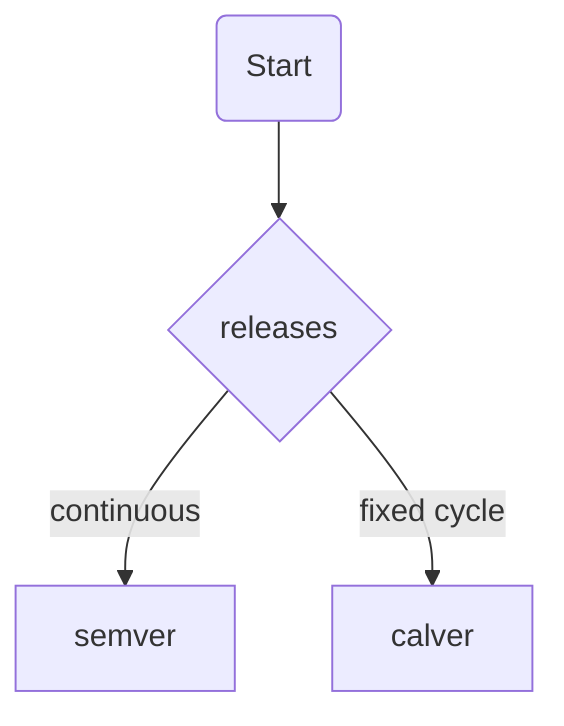

# _Naming Things_

**A humble effort to solve computer science's second-hardest problem.**

<!-- mdformat-toc start --slug=github --no-anchors --maxlevel=2 --minlevel=2 -->

- [Classes and Functions](#classes-and-functions)
- [Time](#time)
- [Abbreviations](#abbreviations)
- [Metrics, Measurements, and Units](#metrics-measurements-and-units)
- [Utils & Helpers](#utils--helpers)
- [Synonyms](#synonyms)
- [Versioning](#versioning)

<!-- mdformat-toc end -->

# Preamble

> There are only two hard things in Computer Science: cache invalidation and naming things.
>
> — Phil Karlton

This document concerns natural language conventions, not syntax or code style. Rules are language-agnostic, but examples are given in Python.

[](https://xkcd.com/910/)

## Classes and Functions

### Classes

Class names are nouns or noun phrases. Think German compound nouns. E.g., `UserProfile`, `OrderItem`, `PaymentProcessor`.

Class names are singular because while its instances may represent multiple entities (e.g., a `User` class representing multiple instances users), the class itself is a blueprint for a single entity.

#### Inheritance

Specialize, don't generalize. If you feel the urge to name a base class `BaseSomething` or `AbstractSomething`, go the other way.
Make children more specific, not parents more general.

##### Do's

```python
class Vehicle:
    """A means of transporting people or goods."""


class Car(Vehicle):
    """A road vehicle, typically with four wheels, powered by an internal combustion engine or electric motor."""


class SUV(Car):
    """A pedestrian death machine."""
```

##### Don'ts

```python
class BaseCar:
    """A road vehicle, typically with four wheels, powered by an internal combustion engine or electric motor."""


class SportsCar(BaseCar):
    """Only fun in Germany."""
```

### Functions

Function represent an action a caller can perform. Use verbs or verb phrases E.g., `send()`, `calculate_total()`.

Function names must clearly communicate their external behavior, including side effects. E.g., `fetch_or_404()` makes it explicit that it may raise a 404 error.
They must not expose internal implementation details. E.g., avoid `send_via_smtp()`; use `send()` instead.

Loose functions should be the exception, not the rule. Prefer class methods or instance methods to group related functionality. If a function includes an noun in its name, it probably belongs to that noun's class. E.g., instead of `fetch_user_profile(user_id)`, implement `UserProfile.fetch(user_id)`.

### Methods

Avoid including object names, as the method is probably attached to wrong class. E.g., instead of `user.send_email()`, use `UserEmail(user).send()`.

## Time

_[Time zones are hard](https://www.youtube.com/watch?v=-5wpm-gesOY); don't make it harder._

### Events & Points in Time

Points in time should always have a little `at`-suffix to communicate they represent a specific moment rather than a duration or interval.

Furthermore, they must be in the language's date type (e.g., `datetime` in Python, `Date` in JavaScript) as well as timezone-aware.

Hindsight is 20/20; name all dates in the past tense, e.g., `created_at`, `updated_at`, `deleted_at`. Even if the event is in the future, e.g., `scheduled_at`, `expired_at`, `started_at`. Time passes. By the time you are debugging code, everything is in the past.

Avoid locale-specific string representations or include a timezone suffix. Suffix dates according to their [IANA timezone](https://en.wikipedia.org/wiki/List_of_tz_database_time_zones).

#### Do's

```python
import datetime

# base case
created_at: datetime.datetime = datetime.datetime.now(tz=datetime.timezone.utc)

# local date with timezone
created_at_europe_berlin: datetime.date = datetime.date.today()
created_at_utc: datetime.date = datetime.date.today()

# UNIX Epoch timestamp
created_at_ts: float = datetime.datetime.now(tz=datetime.timezone.utc).timestamp()
# ISO 8601 string with timezone
created_at_iso: str = datetime.datetime.now(tz=datetime.timezone.utc).isoformat()
```

#### Don'ts

```python
import datetime

# present tense
start = datetime.datetime.now(tz=datetime.timezone.utc)

# no event suffix
created = datetime.datetime.now()

# naive datetime
created_at: datetime.datetime = datetime.datetime.now()
```

### Durations and intervals

Durations should be either unambiguously typed (e.g., `timedelta` in Python, `Duration` in Java) or have a suffix indicating the unit of time (e.g., `secs`, `ms`, `mins`, `hours`, `days`).

#### Do's

```python
import datetime

# typed duration
timeout: datetime.timedelta = datetime.timedelta(seconds=30)
# unit suffix
timeout_secs: int = 30
timeout_ms: int = 30000
```

#### Don'ts

```python
# no interval specific type or unit
timeout: int = 30
```

## Abbreviations

> Abbreviations rely on context you may or may not have.
>
> — [CodeAesthetic](https://www.youtube.com/watch?v=-J3wNP6u5YU)

[](https://xkcd.com/1221/)

**Don't use abbreviations!**

Unless… they are technical acronyms that are universally known outside your team's domain, e.g., `HTML`, `URL`. Use them if they are more common than their unabbreviated counterparts.

### Do's

- **HTML** (HyperText Markup Language)
- **URL** (Uniform Resource Locator)
- **URI** (Uniform Resource Identifier)
- **CPU** (Central Processing Unit)
- **GPU** (Graphics Processing Unit)
- **RAM** (Random Access Memory)
- **JSON** (JavaScript Object Notation)
- **XML** (eXtensible Markup Language)
- **HTTP** (HyperText Transfer Protocol)
- **HTTPS** (HyperText Transfer Protocol Secure)
- **FTP** (File Transfer Protocol)
- **SMTP** (Simple Mail Transfer Protocol)
- **DNS** (Domain Name System)
- **TLS** (Transport Layer Security)
- **SSL** (Secure Sockets Layer)
- **TCP** (Transmission Control Protocol)
- **UDP** (User Datagram Protocol)
- **SQL** (Structured Query Language)
- **API** (Application Programming Interface)
- **GUI** (Graphical User Interface)
- **IDE** (Integrated Development Environment)
- **OS** (Operating System)
- **IPv4** (Internet Protocol Version 4)
- **IPv6** (Internet Protocol Version 6)

### Don'ts

- IP – could mean `Intellectual Property`, use `IPv4` or `IPv6`
- temp – use `temporary` or `temperature`
- addr – use `address`
- num – use `number`
- cnt – use `count`
- cfg – use `config` or `configuration`
- msg – use `message`
- calc – use `calculate` or `calculation`
- init – use `initialize` or `initialization`
- var – use `variable`
- obj – use `object`
- func – use `function` or `method`
- btn – use `button`
- usr – use `user`
- pwd – use `password`
- db – use `database`

## Metrics, Measurements, and Units

### Units

Add an explicit unit suffix to all measurements. Use [SI unit symbols](https://en.wikipedia.org/wiki/International_System_of_Units#Unit_symbols) for brevity.

When persisting metrics, consider using SI (metric) units instead of [freedom units](https://en.wiktionary.org/wiki/freedom_units), as they are the international standard and simplify conversions.

#### Do's

```python
class WeatherReport:
    temperature_c: float  # temperature in degrees Celsius
    distance_km: float  # distance in kilometers
    weight_kg: float  # weight in kilograms
    speed_kmh: float  # speed in kilometers per hour
    volume_l: float  # volume in liters
```

#### Don'ts

```python
class WeatherReport:
    temperature: float  # ambiguous
    distance: float  # ambiguous
    weight: float  # ambiguous
    speed: float  # ambiguous
    volume: float  # ambiguous
```

### Sizes

Always be explicit about sizes. Size matters! Do you know the size of a BIGINT or a SMALLINT in your database of choice?

#### Do's

```python
from PIL import Image


class Profile:
    picture_w1200: Image  # if width is 1200 pixels and height is variable
    picture_w400_h300: Image  # if width is 400 pixels and height is 300 pixels
```

#### Don'ts

```python
from PIL import Image


class Profile:
    picture_small: Image  # ambiguous
    picture_large: Image  # ambiguous
    picture_thumbnail: Image  # ambiguous
```

## Utils & Helpers

> **[Resterampe /ˈʁɛstɐˌʁampə/](https://en.wiktionary.org/wiki/Resterampe)**
>
> A German term for a place where leftover goods are collected and sold cheaply.

Avoid generic names like `utils`, `helpers`, `common`, `shared`, `lib`, `core`, `base`, `foundation`, `services`, `components`, etc.

For type-agnostic functions, use inheritance and class methods to group them meaningfully.
E.g., instead of a `utils` module with a function `to_json(obj)`, create a `Object.to_json(self)` method on relevant classes.

If there isn't a type yet, create one. E.g., instead of a `helpers` module with a function `send_email(to, subject, body)`, create an `EmailClient` class with a `send_email(self, to, subject, body)` method.

## Synonyms

Avoid synonyms to reduce cognitive load. Pick one term and stick with it throughout your codebase.

Here's a non-exhaustive list of common synonyms and their preferred alternatives:

| Avoid                          | Prefer    |
| ------------------------------ | --------- |
| fetch/retrieve                 | fetch     |
| search/query/find              | search    |
| get/load/access                | get       |
| send/dispatch/transmit         | send      |
| create/make/build              | create    |
| delete/remove/destroy          | delete    |
| update/modify/change           | update    |
| calculate/compute/determine    | calculate |
| item/thing/object              | item      |
| data/info/information          | data      |
| value/val/amount               | value     |
| list/array/collection          | list      |
| clean/sanitize/normalize       | clean     |
| start/begin/initiate           | start     |
| stop/end/terminate             | stop      |
| many/multiple/numerous/several | multiple  |

Be specific and avoid vague terms. E.g., instead of `number`, use `count`, `index`, `mean`, etc.

Here's a non-exhaustive list of ambiguous terms and their preferred alternatives:

| Avoid   | Prefer            |
| ------- | ----------------- |
| number  | count/index/mean  |
| average | mean/median       |
| amount  | sum/count/min/max |

### Exceptions

Some terms have contextual meanings and should be used explicitly in those contexts.

#### Get vs. Fetch vs. Search

- **Get**: Use for simple, synchronous access to data already in memory or readily available.
- **Fetch**: Use for asynchronous or remote data retrieval, such as from a database or API.
- **Search**: Use when querying data based on specific criteria or filters with an unknown result set including zero results.

#### Set vs. Send

- **Set**: Use for assigning values to variables, properties, or configurations.
- **Send**: Use for transmitting data or messages over a network or between components. If HTTP is involved, always use the correct request method (e.g., `post()`, `put()`).

## Versioning

It's simple: if your project does continuous releases, use [Semantic Versioning](https://semver.org/).
If you are on a fixed release cycle, use [calver](https://calver.org/) `YYYY.MINOR.MICRO`
. E.g., `2024.2.3` for the third patch of the second minor release in 2024.

Here's a diagram to help you decide:



Do not invent your own versioning scheme.

# Honorable mentions

- [Naming Things in Code](https://www.youtube.com/watch?v=-J3wNP6u5YU) by CodeAesthetic

# License

This work is licensed under a [CC0 1.0 Universal License](https://creativecommons.org/publicdomain/zero/1.0/).
Do with it as you please; maybe leave a star on [GitHub](https://github.com/codingjoe/naming-things). Thanks \<3
