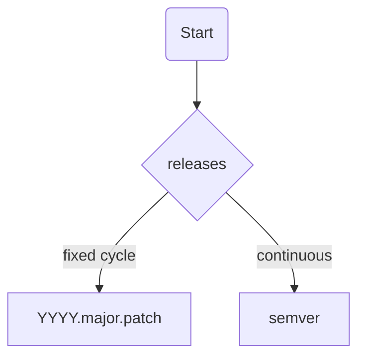

# _Naming Things_

**A humble effort to solve computer science second-hardest problem.**

<!-- mdformat-toc start --slug=github --no-anchors --maxlevel=4 --minlevel=2 -->

- [Abstraction](#abstraction)
  - [Inheritance](#inheritance)
    - [Do's](#dos)
    - [Don'ts](#donts)
- [Time](#time)
  - [Events – Points in time](#events-%E2%80%93-points-in-time)
    - [Do's](#dos-1)
    - [Don'ts](#donts-1)
  - [Durations and intervals](#durations-and-intervals)
    - [Do's](#dos-2)
    - [Don'ts](#donts-2)
- [Versioning](#versioning)

<!-- mdformat-toc end -->

# Preamble

> There are only two hard things in Computer Science: cache invalidation and naming things.
>
> — Phil Karlton

This document concerns natural language conventions not syntax or code style. Rules are language-agnostic, but examples are given in Python.

## Abstraction

### Inheritance

Specialize, don't generalize. If you feel the urge to name a base class `BaseSomething` or `AbstractSomething`, go the other way.
Make children more specific, not parents more general.

#### Do's

```python
class Vehicle:
    """A means of transporting people or goods."""


class Car(Vehicle):
    """A road vehicle, typically with four wheels, powered by an internal combustion engine or electric motor."""


class SUV(Car):
    """A pedestrian death machine."""
```

#### Don'ts

```python
class BaseCar:
    """A road vehicle, typically with four wheels, powered by an internal combustion engine or electric motor."""


class SportsCar(BaseCar):
    """Only fun in Germany."""
```

## Time

_[Timezones are hard](https://www.youtube.com/watch?v=-5wpm-gesOY), don't make it harder._

### Events – Points in time

Points in time should always have a little `at`-suffix to communicate they represent a specific moment rather than a duration or interval.

Furthermore, they must be in the language's date type (e.g., `datetime` in Python, `Date` in JavaScript) as well as timezone-aware.

Hindsight is 20/20, name all dates in the past tense, e.g., `created_at`, `updated_at`, `deleted_at`. Even if the event is in the future, e.g., `scheduled_at`, `expired_at`, `started_at`. Time passes. By the time you are debugging code, everything is in the past.

Avoid locale-specific string representations or include a timezone suffix. Suffix dates according to their [IANA timezone](https://en.wikipedia.org/wiki/List_of_tz_database_time_zones).

#### Do's

```python
import datetime

# base case
created_at: datetime.datetime = datetime.datetime.now(tz=datetime.timezone.utc)

# local date with timezone
created_at_europe_berlin: datetime.date = datetime.date.today()
created_at_utc: datetime.date = datetime.date.today()

# UNIX Epoch timestamp
created_at_ts: float = datetime.datetime.now(tz=datetime.timezone.utc).timestamp()
# ISO 8601 string with timezone
created_at_iso: str = datetime.datetime.now(tz=datetime.timezone.utc).isoformat()
```

#### Don'ts

```python
import datetime

# present tense
start = datetime.datetime.now(tz=datetime.timezone.utc)

# no event suffix
created = datetime.datetime.now()

# naive datetime
created_at: datetime.datetime = datetime.datetime.now()
```

### Durations and intervals

Durations should be either be unambiguously typed (e.g., `timedelta` in Python, `Duration` in Java) or have a suffix indicating the unit of time (e.g., `secs`, `ms`, `mins`, `hours`, `days`).

#### Do's

```python
import datetime

# typed duration
timeout: datetime.timedelta = datetime.timedelta(seconds=30)
# unit suffix
timeout_secs: int = 30
timeout_ms: int = 30000
```

#### Don'ts

```python
# no interval specific type or unit
timeout: int = 30
```

## Versioning

It's simple: if your project does continuous releases, use [Semantic Versioning](https://semver.org/).
If you are on a fixed release cycle, use [calver](https://calver.org/) `YYYY.MINOR.MICRO`
. E.g., `2024.2.3` for the third patch of the second minor release in 2024.

Here's a diagram to help you decide:



Do not invent your own versioning scheme.

# Honorable mentions

- [Naming Things in Code](https://www.youtube.com/watch?v=-J3wNP6u5YU) by CodeAesthetic

# License

This work is licensed under a [CC0 1.0 Universal License](https://creativecommons.org/publicdomain/zero/1.0/).
Do with it as you please, maybe leave a star on [GitHub](https://github.com/codingjoe/naming-things). Thanks \<3
