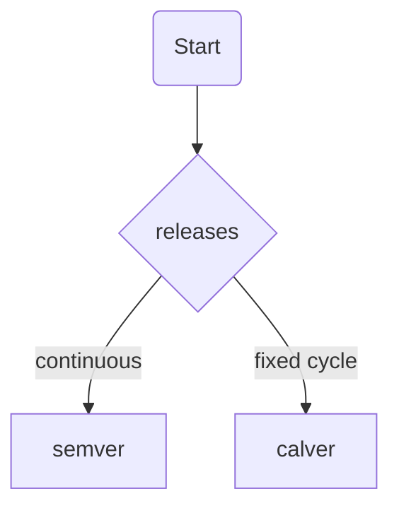

# _Naming Things_

**A humble effort to solve computer science's second-hardest problem.**

> [!TIP]
> **Claude:**
>
> ```
> /plugin marketplace add codingjoe/claude-plugins
> /plugin install naming-things@codingjoe
> ```
>
> Or copy the following snippet into your `AGENTS.md` or `CONTRIBUTING.md` file:
>
> ```markdown
> You MUST ALWAYS follow the [naming-things](https://raw.githubusercontent.com/codingjoe/naming-things/refs/heads/main/README.md) guidelines.
> <!--
> Bots/Agents MUST use:
> curl -sSL https://raw.githubusercontent.com/codingjoe/naming-things/refs/heads/main/README.md | head -n 500
> -->
> ```

<!-- mdformat-toc start --slug=github --no-anchors --maxlevel=2 --minlevel=2 -->

- [Classes and Functions](#classes-and-functions)
- [Unit Tests](#unit-tests)
- [Time](#time)
- [Abbreviations](#abbreviations)
- [Metrics, Measurements, and Units](#metrics-measurements-and-units)
- [Utils & Helpers](#utils--helpers)
- [Synonyms](#synonyms)
- [Avoid Negations](#avoid-negations)
- [Versioning](#versioning)

<!-- mdformat-toc end -->

# Preamble

> There are only two hard things in Computer Science: cache invalidation and naming things.
>
> — Phil Karlton

These are natural-language conventions, not syntax or code style. Rules are language-agnostic, but examples are in Python.

[](https://xkcd.com/910/)

## Classes and Functions

### Classes

Class names are singular nouns or noun phrases, like German compound nouns: `UserProfile`, `OrderItem`, `PaymentProcessor`. While a class's instances may represent multiple entities, the class itself is a blueprint for a single entity.

#### Inheritance

Specialize, do not generalize. If you want to name a class `BaseSomething` or `AbstractSomething`, go the other way: make children more specific, not parents more general.

##### Do's

```python
class Vehicle:
    """A means of transporting people or goods."""


class Car(Vehicle):
    """A road vehicle, typically with four wheels, powered by an internal combustion engine or electric motor."""


class SUV(Car):
    """A pedestrian death machine."""
```

##### Don'ts

```python
class BaseCar:
    """A road vehicle, typically with four wheels, powered by an internal combustion engine or electric motor."""


class SportsCar(BaseCar):
    """Only fun in Germany."""
```

### Functions

A function is an action a caller performs. Name it with a verb or verb phrase: `send()`, `calculate_total()`. Function names must state external behavior, including side effects (`fetch_or_404()` raises a 404). They must not expose internals: avoid `send_via_smtp()`, use `send()`.

Prefer class or instance methods over standalone functions. If a function name includes a noun, it belongs on that noun's class: `UserProfile.fetch(user_id)`, not `fetch_user_profile(user_id)`.

### Methods

Avoid object names in method names. The method is probably on the wrong class. Use `UserEmail(user).send()`, not `user.send_email()`.

### Variables

Avoid variables used only once. If a value is asserted or returned immediately, use it inline.

## Unit Tests

Unit tests mirror their API counterparts so a simple text search reveals both the implementation and its tests.

Test names use double underscores to separate the function or class name from the scenario (for example, `test_get_user__ok`, `test_get_user__raise_value_error`).

- Test classes are prefixed with `Test` in Python or wrapped in `describe` blocks in JavaScript.
- Test descriptions use the imperative mood and avoid redundant words such as "should", "expect", or "it".
- Assertion messages add meaningful context beyond the assertion itself, or are omitted.
- In Node.js, use strict assertions by default with `import assert from "node:assert/strict"` for shorter function names and stricter equality checks.

### Do's

```python
def get_user(user_id):
    """Fetch user from database."""
    ...


class TestGetUser:  # prefix with Test
    def test_get_user__ok(self):  # double underscore separates scenario
        """Return user when found."""  # imperative mood
        assert isinstance(get_user(1), User)  # inline single-use values

    def test_get_user__raise_value_error(self):  # descriptive scenario name
        """Raise ValueError when user ID is invalid."""  # meaningful context
        with pytest.raises(ValueError):
            get_user(-1)
```

```javascript
import assert from "node:assert/strict"; // strict assertions by default

function getUser(userId) {
    // Fetch user from database
}

describe("getUser", () => { // wrap in describe block
    test("ok", () => { // no "should", "expect", or "it"
        assert(getUser(1) instanceof User); // inline single-use values
    });

    test("raise ValueError", () => { // descriptive scenario
        assert.throws(() => getUser(-1), ValueError);
    });
});

// assertion messages add context or are omitted
assert.ok(user.age >= 18, "User must be adult to access premium features");
assert.equal(user.name, "Alice"); // omit when self-explanatory
```

### Don'ts

```python
def test_validate_email(self):
    """It should return True when email is valid."""  # avoid "should", "it"


def test_validate_email(self):
    """We expect True for valid emails."""  # avoid "expect"


def test_create_user__ok(self):
    """Return user instance."""
    user = create_user("Alice")  # unnecessary variable
    assert isinstance(user, User)
```

```javascript
test("validateEmail", () => {
    // It should return true when email is valid  // avoid "it", "should"
});

test("createUser__ok", () => {
    const user = createUser("Alice"); // unnecessary variable
    assert(user instanceof User);
});

assert.equal(user.name, "Alice", "user.name should equal Alice"); // repeats assertion
```

## Time

_[Time zones are hard](https://www.youtube.com/watch?v=-5wpm-gesOY); do not make it harder._

### Events & Points in Time

Points in time carry an `at` suffix to mark a specific moment, not a duration or interval. They must use the language's date type (`datetime` in Python, `Date` in JavaScript) and be timezone-aware.

Name dates in the past tense (`created_at`, `updated_at`, `deleted_at`), even future events (`scheduled_at`, `expired_at`). Time passes; everything is in the past by the time you debug.

Avoid locale-specific strings. If you must use a string, include a timezone suffix. Suffix dates according to their [IANA timezone](https://en.wikipedia.org/wiki/List_of_tz_database_time_zones).

#### Do's

```python
import datetime

# base case
created_at: datetime.datetime = datetime.datetime.now(tz=datetime.timezone.utc)

# local date with timezone
created_at_europe_berlin: datetime.date = datetime.date.today()
created_at_utc: datetime.date = datetime.date.today()

# UNIX Epoch timestamp
created_at_ts: float = datetime.datetime.now(tz=datetime.timezone.utc).timestamp()
# ISO 8601 string with timezone
created_at_iso: str = datetime.datetime.now(tz=datetime.timezone.utc).isoformat()
```

#### Don'ts

```python
import datetime

# present tense
start = datetime.datetime.now(tz=datetime.timezone.utc)

# no event suffix
created = datetime.datetime.now()

# naive datetime
created_at: datetime.datetime = datetime.datetime.now()
```

### Durations and intervals

Durations are either unambiguously typed (`timedelta` in Python, `Duration` in Java) or carry a unit suffix (`secs`, `ms`, `mins`, `hours`, `days`).

#### Do's

```python
import datetime

# typed duration
timeout: datetime.timedelta = datetime.timedelta(seconds=30)
# unit suffix
timeout_secs: int = 30
timeout_ms: int = 30000
```

#### Don'ts

```python
# no interval specific type or unit
timeout: int = 30
```

## Abbreviations

> Abbreviations rely on context you may or may not have.
>
> — [CodeAesthetic](https://www.youtube.com/watch?v=-J3wNP6u5YU)

[](https://xkcd.com/1221/)

**Do not use abbreviations!** Unless they are technical acronyms universally known outside your team's domain (`HTML`, `URL`). Use them only when more common than the full term.

### Do's

- **HTML** (HyperText Markup Language)
- **URL** (Uniform Resource Locator)
- **URI** (Uniform Resource Identifier)
- **CPU** (Central Processing Unit)
- **GPU** (Graphics Processing Unit)
- **RAM** (Random Access Memory)
- **JSON** (JavaScript Object Notation)
- **XML** (eXtensible Markup Language)
- **HTTP** (HyperText Transfer Protocol)
- **HTTPS** (HyperText Transfer Protocol Secure)
- **FTP** (File Transfer Protocol)
- **SMTP** (Simple Mail Transfer Protocol)
- **DNS** (Domain Name System)
- **TLS** (Transport Layer Security)
- **SSL** (Secure Sockets Layer)
- **TCP** (Transmission Control Protocol)
- **UDP** (User Datagram Protocol)
- **SQL** (Structured Query Language)
- **API** (Application Programming Interface)
- **GUI** (Graphical User Interface)
- **IDE** (Integrated Development Environment)
- **OS** (Operating System)
- **IPv4** (Internet Protocol Version 4)
- **IPv6** (Internet Protocol Version 6)

### Don'ts

- IP – could mean `Intellectual Property`, use `IPv4` or `IPv6`
- temp – use `temporary` or `temperature`
- addr – use `address`
- num – use `number`
- cnt – use `count`
- cfg – use `config` or `configuration`
- msg – use `message`
- calc – use `calculate` or `calculation`
- init – use `initialize` or `initialization`
- var – use `variable`
- obj – use `object`
- func – use `function` or `method`
- btn – use `button`
- usr – use `user`
- pwd – use `password`
- db – use `database`

## Metrics, Measurements, and Units

### Units

Add an explicit unit suffix to all measurements, using [SI unit symbols](https://en.wikipedia.org/wiki/International_System_of_Units#Unit_symbols) for brevity. For persisted metrics, prefer SI (metric) units over [freedom units](https://en.wiktionary.org/wiki/freedom_units). They are the international standard and simplify conversions.

#### Do's

```python
class WeatherReport:
    temperature_c: float  # temperature in degrees Celsius
    distance_km: float  # distance in kilometers
    weight_kg: float  # weight in kilograms
    speed_kmh: float  # speed in kilometers per hour
    volume_l: float  # volume in liters
```

#### Don'ts

```python
class WeatherReport:
    temperature: float  # ambiguous
    distance: float  # ambiguous
    weight: float  # ambiguous
    speed: float  # ambiguous
    volume: float  # ambiguous
```

### Sizes

Be explicit about sizes. Do you know the size of a BIGINT or SMALLINT in your database?

#### Do's

```python
from PIL import Image


class Profile:
    picture_w1200: Image  # if width is 1200 pixels and height is variable
    picture_w400_h300: Image  # if width is 400 pixels and height is 300 pixels
```

#### Don'ts

```python
from PIL import Image


class Profile:
    picture_small: Image  # ambiguous
    picture_large: Image  # ambiguous
    picture_thumbnail: Image  # ambiguous
```

## Utils & Helpers

> **[Resterampe /ˈʁɛstɐˌʁampə/](https://en.wiktionary.org/wiki/Resterampe)**
>
> A German term for a place where leftover goods are collected and sold cheaply.

Avoid generic module names: `utils`, `helpers`, `common`, `shared`, `lib`, `core`, `base`, `foundation`, `services`, `components`.

For type-agnostic functions, group them with class methods. Put `to_json()` on relevant classes instead of a `utils` module.

If no type exists, create one: make an `EmailClient` with a `send_email()` method instead of a `helpers` module.

## Synonyms

Pick one term per concept and use it throughout your codebase to reduce cognitive load.

Here is a non-exhaustive list of common synonyms and their preferred alternatives:

| Avoid                          | Prefer    |
| ------------------------------ | --------- |
| fetch/retrieve                 | fetch     |
| search/query/find              | search    |
| get/load/access                | get       |
| send/dispatch/transmit         | send      |
| create/make/build              | create    |
| delete/remove/destroy          | delete    |
| update/modify/change           | update    |
| calculate/compute/determine    | calculate |
| item/thing/object              | item      |
| data/info/information          | data      |
| value/val/amount               | value     |
| list/array/collection          | list      |
| clean/sanitize/normalize       | clean     |
| start/begin/initiate           | start     |
| stop/end/terminate             | stop      |
| many/multiple/numerous/several | multiple  |

Be specific and avoid vague terms. For example, instead of `number`, use `count`, `index`, or `mean`.

Here is a non-exhaustive list of ambiguous terms and their preferred alternatives:

| Avoid   | Prefer            |
| ------- | ----------------- |
| number  | count/index/mean  |
| average | mean/median       |
| amount  | sum/count/min/max |

### Exceptions

Some terms have contextual meanings and are used explicitly in those contexts.

#### Get vs. Fetch vs. Search

- **Get**: Use for simple, synchronous access to data already in memory or readily available.
- **Fetch**: Use for asynchronous or remote data retrieval, such as from a database or API.
- **Search**: Use when querying data based on specific criteria or filters with an unknown result set including zero results.

#### Set vs. Send

- **Set**: Use for assigning values to variables, properties, or configurations.
- **Send**: Use for transmitting data or messages over a network or between components. If HTTP is involved, always use the correct request method (for example, `post()`, `put()`).

## Avoid Negations

Use positive language. `if (is_enabled)` is clearer than `if (!is_disabled)`.

### Do's

```python
enable_feature = False  # not: disable_feature = True
is_valid = True  # not: is_invalid = False
has_permission = True  # not: lacks_permission = False
```

### Don'ts

```python
disable_feature = True  # confusing when set to False
is_not_active = False  # double negation
if not is_disabled:  # hard to parse
```

### Common Patterns

| Avoid          | Prefer    |
| -------------- | --------- |
| disable        | enable    |
| invalid        | valid     |
| incomplete     | complete  |
| does_not_exist | exists    |
| prevent        | grant     |
| ignore         | handle    |
| avoid          | allow     |
| fail           | succeed   |
| missing        | present   |
| incorrect      | correct   |
| unavailable    | available |
| inactive       | active    |
| prohibited     | permitted |
| rejected       | accepted  |
| denied         | granted   |

> [!NOTE]
> Use negative terms when they are the standard (for example, `disabled` for HTMLInputElements) or inherently negative (for example, `error`, `exception`).

## Versioning

Continuous releases: use [Semantic Versioning](https://semver.org/). Fixed release cycle: use [calver](https://calver.org/) `YYYY.MINOR.MICRO` (`2024.2.3` is the third patch of the second minor release of 2024).

Here is a diagram to help you decide:


```mermaid
flowchart TD
    A(Start) --> B{releases}
    B -- continuous --> D[semver]
    B -- fixed cycle --> C[calver]
```

Do not invent your own versioning scheme.

# Honorable mentions

- [Naming Things in Code](https://www.youtube.com/watch?v=-J3wNP6u5YU) by CodeAesthetic

# License

This work is licensed under a [CC0 1.0 Universal License](https://creativecommons.org/publicdomain/zero/1.0/).
Do with it as you please; maybe leave a star on [GitHub](https://github.com/codingjoe/naming-things). Thanks \<3
